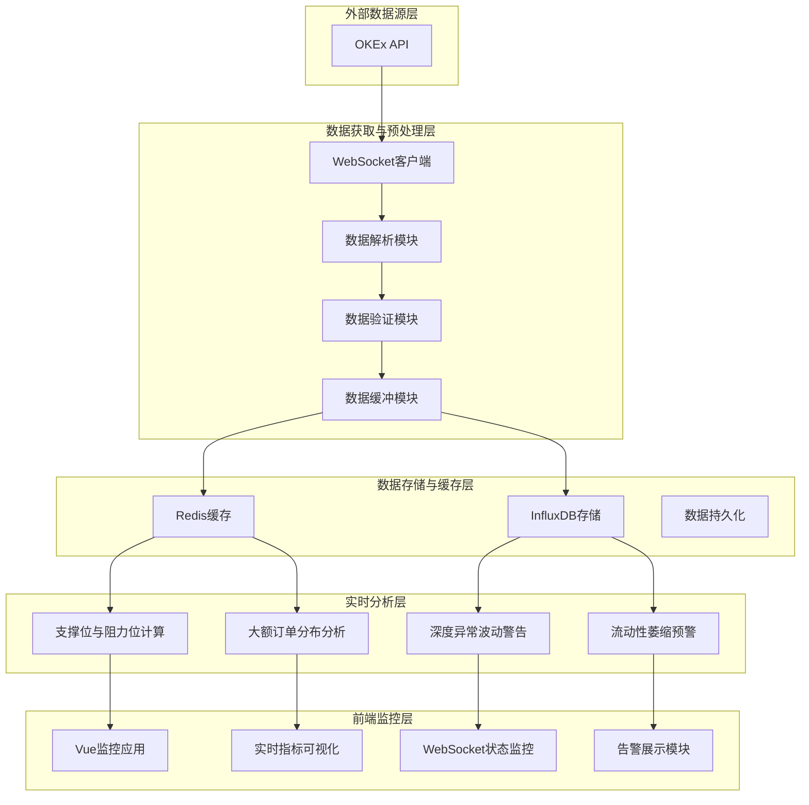
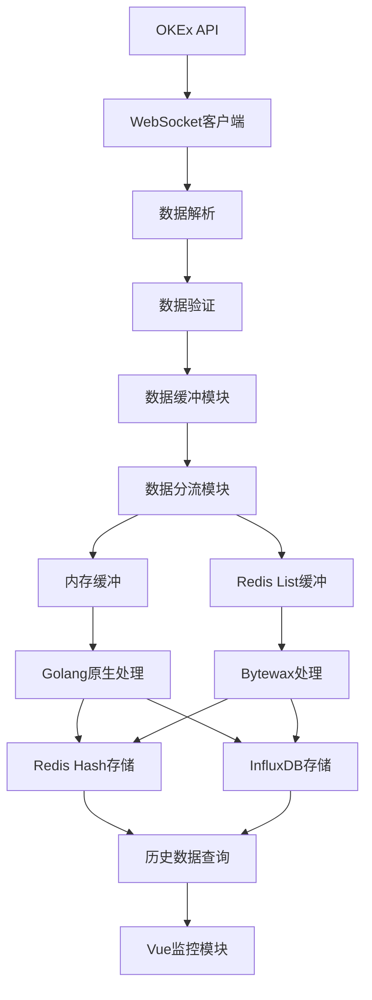
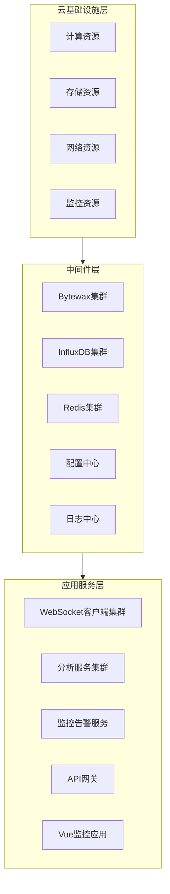
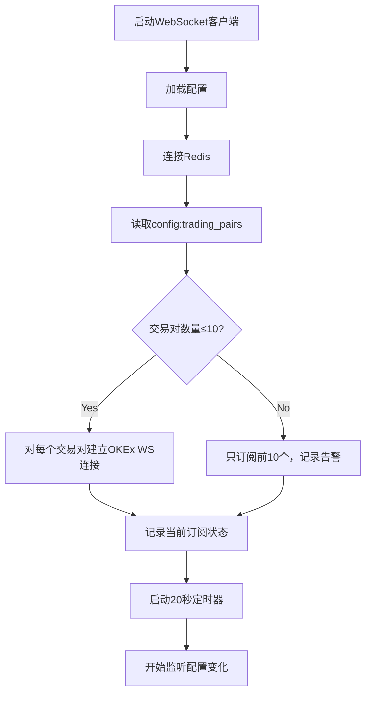
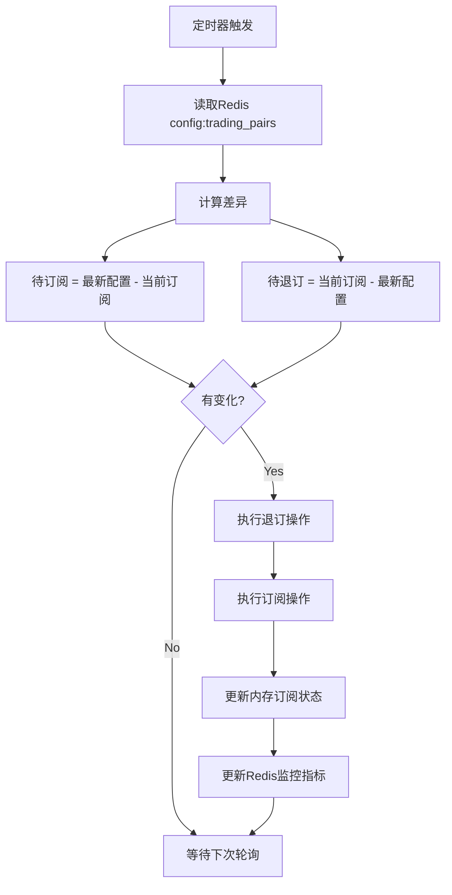

# OKEx订单簿实时分析系统
## 架构设计文档

## 1. 文档概述

### 1.1 文档目的
本文档旨在详细描述OKEx订单簿实时分析系统的技术架构设计，包括系统组件、数据流、模块划分和技术选型，为开发团队提供清晰的技术实现指导。

### 1.2 适用范围
本文档适用于系统架构师、开发团队和运维团队。

### 1.3 参考文档
- OKEx订单簿实时分析系统PRD
- OKX API文档：https://www.okx.com/docs-v5/zh/#order-book-trading-market-data-ws-order-book-channel

## 2. 架构目标

### 2.1 核心目标
构建一个高性能、高可用的实时订单簿分析系统，满足PRD中定义的所有功能和性能要求。

### 2.2 具体目标
- 支持最多10个交易对同时监控
- 实现≤50ms的实时分析延迟
- 确保数据准确性和系统稳定性
- 提供良好的可扩展性和可维护性
- 合理分配计算资源，优化系统性能

## 3. 技术选型

### 3.1 核心技术栈
- **开发语言**：Golang、Python、JavaScript
- **Websocket客户端**：Gorilla Websocket
- **流处理引擎**：Bytewax
- **时序数据库**：InfluxDB
- **缓存数据库**：Redis
- **前端框架**：Vue.js 3.x
- **图表库**：ECharts 或 Chart.js
- **UI组件库**：Element Plus

### 3.2 技术选型理由
- **Golang**：高性能、高并发特性适合实时数据处理场景
- **Gorilla Websocket**：成熟稳定的Websocket客户端库，适合与OKEx API对接
- **Bytewax**：基于Python的流处理框架，适合复杂的实时数据分析任务
- **InfluxDB**：专门针对时序数据优化的数据库，高写入吞吐量，适合实时数据存储和查询
- **Redis**：高性能内存数据库，支持多种数据结构，适合作为缓存层和消息缓冲
- **Vue.js 3.x**：现代化前端框架，响应式设计适合实时数据展示，生态成熟，开发效率高
- **ECharts/Chart.js**：强大的图表库，支持实时数据可视化，适合WebSocket指标监控场景
- **Element Plus**：基于Vue 3的UI组件库，提供丰富的组件，加速前端界面开发

## 4. 系统架构设计

### 4.1 架构概述
系统采用分层架构设计，主要分为以下核心层次：



### 4.2 核心组件详细设计

#### 4.2.1 WebSocket客户端模块
- **职责**：与OKEx API建立并维护WebSocket连接，获取订单簿数据
- **技术实现**：Golang + Gorilla Websocket
- **关键特性**：
  - 支持最多10个交易对的并行连接
  - 自动重连机制
  - 连接状态监控
  - **动态订阅管理**：
    - 从Redis（`config:trading_pairs`）读取交易对配置
    - 定时监听（每20秒）Redis配置变化
    - 检测到变化后自动执行退订/订阅操作
    - 支持外部系统通过修改Redis key动态调整监控范围

#### 4.2.2 数据解析与验证模块
- **职责**：解析WebSocket接收到的原始数据，验证数据完整性和准确性
- **功能**：
  - 解析JSON格式数据
  - 验证数据结构和字段
  - 处理增量数据更新

#### 4.2.3 数据缓冲模块
- **职责**：临时存储原始数据和处理结果
- **类型**：
  - 内存缓冲：用于低延迟、小数据量的场景
  - Redis List缓冲：用于中高吞吐量、需要快速数据传递的场景

#### 4.2.4 实时分析模块
- **职责**：执行各项实时分析任务
- **子模块**：
  - 支撑位与阻力位计算
  - 大额订单分布分析
  - 深度异常波动警告
  - 流动性萎缩预警


#### 4.2.6 Vue监控模块
- **职责**：提供WebSocket相关指标和实时分析结果的可视化监控界面
- **技术实现**：Vue.js 3.x + Element Plus + ECharts
- **核心功能**：
  - WebSocket连接状态监控（连接数、断开次数、重连状态）
  - 数据传输指标监控（吞吐量、延迟、数据包大小）
  - 交易对监控状态展示
  - 实时分析结果可视化（支撑位/阻力位、大额订单分布）
  - 异常告警实时展示
  - 历史数据趋势分析
- **数据来源**：
  - 实时分析结果：通过API从Redis Hash结构读取
  - 历史数据：通过API从InfluxDB读取
  - 实时指标：通过WebSocket推送
- **技术特性**：
  - 响应式设计，支持多设备访问
  - 实时数据更新（WebSocket推送）
  - 可自定义监控面板
  - 支持数据导出和报表生成

#### 4.2.7 InfluxDB存储模块
- **职责**：提供高效的时序数据存储和查询能力
- **技术实现**：InfluxDB 2.x
- **核心功能**：
  - 存储WebSocket连接指标（连接数、延迟、吞吐量）
  - 存储订单簿实时数据（价格、数量、深度）
  - 存储实时分析结果（支撑位/阻力位、大额订单分布）
  - 存储告警历史记录
  - 支持时序数据的高效查询和聚合分析
  - 支持数据保留策略配置
- **技术特性**：
  - 专门针对时间序列数据优化的存储引擎
  - 高写入吞吐量，适合实时数据场景
  - 强大的查询语言（Flux）支持复杂分析
  - 内置数据可视化功能
  - 支持数据压缩，降低存储成本

#### 4.2.8 Redis缓存模块
- **职责**：提供高性能的数据缓存能力，存储实时分析结果
- **技术实现**：Redis 6.x
- **核心功能**：
  - 缓存实时订单簿数据（最新400档）
  - 使用Hash结构存储分析结果，每个交易对对应一个Hash键
  - 缓存告警规则配置
  - 存储实时监控指标的聚合数据
  - 支持数据过期策略配置
  - 支持发布/订阅模式，用于模块间实时通信
  - 作为Golang原生处理和Bytewax处理的统一数据输出层
- **技术特性**：
  - 内存存储，亚毫秒级数据访问
  - Hash结构支持高效的字段级操作和查询
  - 高并发支持，适合实时数据场景
  - 内置数据持久化机制
  - 支持分布式部署，可扩展性强


## 5. 数据流与交互流程

### 5.1 系统主要数据流



### 5.2 关键交互流程

#### 5.2.1 数据获取与预处理流程
1. WebSocket客户端启动时从Redis读取交易对配置（`config:trading_pairs`）
2. 根据配置初始化并连接到OKEx API，订阅指定的交易对订单簿数据
3. 启动定时任务（每20秒），监听Redis中交易对配置的变化
4. 接收原始数据并进行解析
5. 验证数据完整性和准确性
6. 根据分析需求将数据分配到不同的缓冲模块

#### 5.2.2 实时分析流程
1. 数据从缓冲模块进入分析模块
2. 根据分析类型选择不同的处理路径：
   - 低延迟需求：内存缓冲 + Golang原生处理
   - 复杂分析需求：Redis List缓冲 + Bytewax处理
3. 执行具体的分析算法
4. 分析结果直接写入Redis对应的Hash结构中，每个交易对使用独立的Hash键
5. 同时将需要持久化的历史数据写入InfluxDB

#### 5.2.4 Vue监控模块交互流程
1. 用户通过浏览器访问Vue监控应用
2. Vue应用建立WebSocket连接到后端监控服务
3. 后端监控服务推送实时指标数据到Vue应用
4. Vue应用使用ECharts渲染实时图表和监控面板
5. 用户可以自定义监控面板、查看历史数据或导出报表

#### 5.2.5 动态订阅管理流程

**初始化阶段**：
1. WebSocket客户端启动，连接到Redis
2. 执行 `SMEMBERS config:trading_pairs` 获取初始交易对列表
3. 验证交易对数量不超过10个，如超过记录告警
4. 对每个交易对建立OKEx WebSocket连接并订阅订单簿数据
5. 记录当前订阅状态到内存（已订阅交易对集合）

**监听变化阶段**：
1. 启动定时器（每20秒触发一次）
2. 执行 `SMEMBERS config:trading_pairs` 获取最新配置
3. 对比最新配置与当前订阅状态，计算差异：
   - `待订阅集合 = 最新配置 - 已订阅集合`
   - `待退订集合 = 已订阅集合 - 最新配置`
4. 如果无变化，继续等待下一次轮询
5. 如果检测到变化，执行订阅调整操作

**订阅调整阶段**：
1. **退订操作**：
   - 对于 `待退订集合` 中的每个交易对：
     - 发送退订请求到OKEx WebSocket
     - 等待退订确认
     - 从内存中移除该交易对的订阅状态
     - 记录日志：`Unsubscribed from {instrument_id}`

2. **订阅操作**：
   - 对于 `待订阅集合` 中的每个交易对：
     - 发送订阅请求到OKEx WebSocket
     - 等待订阅确认
     - 将该交易对添加到内存订阅状态
     - 记录日志：`Subscribed to {instrument_id}`

3. **状态同步**：
   - 更新内存中的已订阅集合
   - 更新Redis系统监控指标（`system:monitoring`）：
     - `active_pairs`：当前活跃交易对数量
     - `websocket_connections`：当前WebSocket连接数

**异常处理**：
- 如果Redis读取失败，记录错误日志，使用当前订阅状态继续运行
- 如果订阅/退订失败，重试最多3次，失败后记录告警
- 如果配置的交易对超过10个，只订阅前10个，并记录告警日志

### 5.3 异常处理流程
1. WebSocket连接中断
   - 自动重连机制触发
   - 重连成功后重新获取完整订单簿数据

2. 数据验证失败
   - 丢弃无效数据
   - 记录错误日志
   - 继续处理后续数据

3. 分析模块异常
   - 自动重启分析模块
   - 确保系统整体可用性

## 6. 实时分析需求处理方式分析

### 6.1 处理方式对比

| 处理方式 | 优势 | 劣势 | 适用场景 |
|---------|------|------|---------|
| 内存缓冲+Golang原生处理 | 低延迟（亚毫秒级）<br>高并发性能<br>实现简单 | 数据易丢失<br>不适合复杂分析<br>扩展性有限 | 低延迟要求的简单分析 |
| Redis List缓冲+Bytewax处理 | 低延迟（亚毫秒级）<br>适合复杂流处理<br>实现简单<br>支持时间窗口分析 | 数据持久化能力有限<br>扩展性一般 | 复杂分析、需要历史数据、低延迟要求 |

### 6.2 支撑位与阻力位计算

#### 6.2.1 需求特点
- 基于当前订单簿数据计算关键价格水平
- 主要涉及统计分析和价格聚类
- 计算复杂度低
- 对延迟要求极高（≤50ms）
- 不需要历史数据支持

#### 6.2.2 推荐处理方式
**内存缓冲 + Golang原生处理**

理由：
- 计算逻辑简单，Golang原生处理完全可以满足性能要求
- 延迟要求极高，内存缓冲可以提供亚毫秒级的数据访问
- 不需要历史数据，不需要复杂的流处理能力
- 实现简单，资源消耗低

### 6.3 大额订单分布分析

#### 6.3.1 需求特点
- 分析大额订单在不同价格区间的分布
- 基于订单分布判断主力多空倾向
- 计算复杂度中等
- 对延迟要求高（≤50ms）
- 可能需要短期历史数据进行对比分析

#### 6.3.2 推荐处理方式
**内存缓冲 + Golang原生处理**

理由：
- 虽然需要分析订单分布模式，但Golang的并发性能足以支持
- 延迟要求高，内存缓冲可以满足实时性需求
- 短期历史数据可以通过内存队列或滑动窗口实现
- 实现相对简单，维护成本低

### 6.4 深度异常波动警告

#### 6.4.1 需求特点
- 监测订单簿深度的异常变化
- 需要分析变化率和异常模式
- 计算复杂度较高
- 对延迟要求高（≤50ms）
- 需要短期历史数据进行对比分析

#### 6.4.2 推荐处理方式
**Redis List缓冲 + Bytewax处理**

理由：
- 需要分析深度变化的异常模式，Bytewax的流处理能力更适合
- 可以利用Bytewax的时间窗口功能实现历史数据对比
- Redis List的低延迟特性满足≤50ms的延迟要求
- 实现简单，资源消耗相对较低

### 6.5 流动性萎缩预警

#### 6.5.1 需求特点
- 监测市场流动性的显著变化
- 需要分析流动性变化趋势
- 计算复杂度较高
- 对延迟要求相对较低
- 需要较长时间窗口的历史数据

#### 6.5.2 推荐处理方式
**Redis List缓冲 + Bytewax处理**

理由：
- 需要分析较长时间窗口的流动性变化趋势，Bytewax的时间窗口功能更适合
- 计算复杂度较高，Bytewax的流处理能力可以更好地支持
- Redis List的低延迟特性满足系统要求
- 实现简单，资源消耗相对较低

### 6.6 处理方式总结

| 分析需求 | 推荐处理方式 | 结果存储 |
|---------|-------------|---------|
| 支撑位与阻力位计算 | 内存缓冲 + Golang原生处理 | Redis Hash结构 |
| 大额订单分布分析 | 内存缓冲 + Golang原生处理 | Redis Hash结构 |
| 深度异常波动警告 | Redis List缓冲 + Bytewax处理 | Redis Hash结构 |
| 流动性萎缩预警 | Redis List缓冲 + Bytewax处理 | Redis Hash结构 |

## 7. 部署架构

### 7.1 部署概述
系统采用云原生部署架构，主要组件分布在以下三个层次：



### 7.2 组件部署详情

#### 7.2.1 WebSocket客户端集群
- 部署方式：Docker容器化
- 实例数量：根据监控的交易对数量动态调整（建议每5个交易对部署1个实例）
- 网络策略：允许与OKEx API建立WebSocket连接

#### 7.2.2 Bytewax集群
- 部署方式：分布式集群
- 节点数量：根据分析复杂度动态调整
- 网络策略：仅允许访问Redis集群

#### 7.2.3 InfluxDB集群
- 部署方式：分布式集群
- 节点数量：3个（最小配置），根据数据量扩展
- 存储策略：使用SSD存储，配置合理的数据保留策略
- 数据备份：定期备份数据，确保数据安全
- 网络策略：仅允许内部服务访问

#### 7.2.4 Redis集群
- 部署方式：分布式集群（主从模式或集群模式）
- 节点数量：3个（最小配置，1主2从），根据缓存需求扩展
- 内存配置：根据数据量配置合适的内存大小
- 持久化策略：开启RDB+AOF混合持久化
- 网络策略：仅允许内部服务访问

#### 7.2.5 分析服务集群
- 部署方式：Docker容器化
- 实例数量：根据分析负载动态调整
- 负载均衡：通过API网关实现请求分发

#### 7.2.6 Vue监控模块
- 部署方式：静态资源部署（Nginx）或容器化（Docker）
- 实例数量：建议2-3个实例，通过负载均衡提高可用性
- 网络策略：允许外部访问，内部仅允许访问API网关和监控服务
- 构建方式：使用Vite进行项目构建，生成静态资源
- 静态资源CDN：可配置CDN加速静态资源访问
- 配置管理：支持环境变量配置，区分开发/测试/生产环境

### 7.3 高可用性设计
- **WebSocket客户端**：多实例部署，故障自动转移
- **Bytewax集群**：分布式架构，支持节点故障恢复
- **InfluxDB集群**：
  - 多副本存储（建议3副本）确保数据可靠性
  - 节点故障自动切换，保持服务可用性
  - 支持数据分片，提高系统扩展性
- **Redis集群**：
  - 主从复制架构，实现数据冗余
  - 哨兵模式或集群模式，实现自动故障转移
  - 数据持久化确保服务重启后数据不丢失
- **分析服务**：多实例部署，通过负载均衡实现高可用
- **Vue监控模块**：多实例部署，静态资源缓存，支持快速故障转移

## 8. 扩展性设计

### 8.1 横向扩展策略

#### 8.1.1 WebSocket客户端扩展
- 根据监控的交易对数量线性扩展实例
- 每个实例负责固定数量的交易对
- 通过配置中心动态调整实例数量

#### 8.1.2 Bytewax处理节点扩展
- 根据分析任务负载动态调整工作节点数量
- 支持弹性伸缩，自动适应负载变化
- 通过增加处理器提高并行处理能力

#### 8.1.3 分析服务扩展
- 无状态设计，支持水平扩展
- 通过负载均衡实现请求分发
- 支持自动扩缩容

#### 8.1.4 Vue监控模块扩展
- 静态资源可通过CDN扩展分发能力
- 多实例部署支持负载均衡
- 组件化设计支持功能模块按需扩展
- 支持自定义插件和主题扩展

#### 8.1.5 InfluxDB集群扩展
- 数据分片扩展：通过增加数据节点实现水平扩展，支持在线扩容
- 副本扩展：根据可用性需求增加副本数量
- 存储扩展：使用分布式存储系统（如S3）扩展存储容量
- 计算资源扩展：根据查询负载增加查询节点

#### 8.1.6 Redis集群扩展
- 节点扩展：通过增加主节点实现数据分片扩展
- 内存扩展：根据缓存需求增加节点内存容量
- 只读副本扩展：根据读负载增加从节点数量
- 支持在线扩容，不影响现有服务

### 8.2 数据分区策略
- **交易对维度**：按交易对划分数据流
- **时间维度**：按时间窗口划分数据
- **分析类型维度**：按分析任务类型划分数据

### 8.3 容量规划
- **WebSocket客户端**：每实例支持5-10个交易对
- **Bytewax节点**：每节点支持2-5个分析任务
- **InfluxDB集群**：
  - 存储容量：根据数据保留策略和交易对数量规划，建议初始配置500GB SSD存储
  - 写入吞吐量：每节点支持约100,000点/秒
  - 查询负载：每查询节点支持约1000 QPS
- **Redis集群**：
  - 内存容量：每主节点建议初始配置8-16GB内存
  - 连接数：每节点支持约10,000并发连接
  - 吞吐量：每主节点支持约100,000 OPS
- **分析服务**：每实例支持5-10个并发请求
- **Vue监控模块**：单实例支持50-100个并发用户，静态资源占用约100MB存储空间

### 8.4 扩展监控
- 实时监控各组件的负载情况
- 设置阈值告警，提前发现扩展需求
- 建立自动扩缩容策略

## 9. 监控与维护

### 9.1 系统监控
- **性能监控**：CPU、内存、网络、磁盘使用率
- **服务监控**：各组件的可用性和响应时间
- **数据监控**：数据获取成功率、数据质量
- **InfluxDB监控**：
  - 写入/查询吞吐量、延迟
  - 数据节点状态、副本状态
  - 磁盘使用情况、数据压缩率
  - 内存使用情况、查询缓存命中率
  - 连接数、错误率
- **Redis监控**：
  - 内存使用率、内存碎片率

### 9.2 应用监控
- **WebSocket连接监控**：连接状态、重连次数
- **分析延迟监控**：各分析任务的处理延迟
- **告警触发监控**：告警次数、类型分布

### 9.3 日志管理
- **统一日志收集**：所有组件日志集中收集
- **日志分析**：使用ELK或类似工具进行日志分析
- **日志保留**：根据需要设置日志保留期限

### 9.4 维护策略
- **定期备份**：关键配置和数据定期备份
- **版本管理**：应用版本统一管理
- **故障演练**：定期进行故障演练，提高系统稳定性
- **InfluxDB维护**：
  - 定期检查数据压缩率，优化存储
  - 根据数据增长情况调整数据保留策略
  - 定期执行数据备份，确保数据安全
  - 监控查询性能，优化慢查询
  - 定期检查节点状态，确保集群健康
- **Redis维护**：
  - 定期检查内存使用情况，优化内存配置
  - 监控持久化操作，确保数据安全
  - 定期清理过期数据，释放内存空间
  - 检查主从复制状态，确保数据一致性
  - 定期执行故障转移演练，验证高可用机制

## 10. Redis List 适用性分析

### 10.1 Redis List 核心特性

| 功能特性 | Redis List |
|---------|------------|
| 数据存储 | 内存中，可选持久化（RDB/AOF） |
| 消息模型 | 队列（FIFO） |
| 延迟 | 亚毫秒级 |
| 吞吐量 | 高（支持每秒10万+操作） |
| 数据持久化 | RDB/AOF（可选） |
| 部署复杂度 | 低 |
| 成本 | 低 |

### 10.2 系统需求匹配度分析

#### 10.2.1 性能需求匹配
- **亚毫秒级延迟**：满足系统≤50ms的延迟要求
- **高吞吐量**：支持10个交易对的实时数据处理需求
- **内存操作**：避免磁盘I/O开销，保证低延迟

#### 10.2.2 功能需求匹配
- **FIFO队列**：适合深度异常波动警告和流动性萎缩预警的数据处理流程
- **简单API**：易于与Golang和Bytewax集成
- **持久化支持**：可配置RDB/AOF确保数据安全

#### 10.2.3 部署与维护需求匹配
- **低部署复杂度**：简化系统架构，减少维护成本
- **低成本**：降低硬件资源需求和运营成本
- **易集成**：与InfluxDB和Redis缓存共享Redis实例，提高资源利用率

### 10.3 最终决策

基于系统需求和Redis List的特性，**最终决定完全采用Redis List作为系统的消息缓冲组件**：

1. **性能优势**：亚毫秒级延迟满足实时分析需求
2. **架构简化**：减少组件数量，降低系统复杂度
3. **成本效益**：降低部署和维护成本
4. **易集成性**：与现有Redis缓存和Bytewax良好集成
5. **扩展性**：当前系统规模（10个交易对）下完全满足需求，可通过Redis集群扩展

### 10.4 风险与应对

**采用Redis List的风险与应对策略**：

1. **数据丢失风险**：
   - **应对**：配置Redis的RDB+AOF混合持久化，确保数据安全
   - **应对**：关键数据定期持久化到InfluxDB作为备份

2. **扩展性风险**：
   - **应对**：采用Redis集群模式，支持节点扩展
   - **应对**：系统设计预留扩展接口，便于未来根据业务需求调整

3. **性能瓶颈风险**：
   - **应对**：优化Redis配置，监控内存使用情况
   - **应对**：实施数据分片策略，均衡负载

## 11. Bytewax与Redis List集成可行性分析

### 11.1 Bytewax核心特性与扩展能力
- **Bytewax**：基于Python的流处理框架，底层使用Rust实现，提供高性能的流处理能力
- **扩展机制**：Bytewax支持自定义源(source)和汇(sink)，可以通过Python代码扩展其功能
- **Python API**：Bytewax主要通过Python API进行使用，允许开发者利用丰富的Python生态系统

### 11.2 Redis List集成方案

#### 11.2.1 实现原理
Bytewax可以通过以下方式与Redis List集成：
1. **自定义Source**：使用Python的`redis`库实现一个Bytewax Source，从Redis List中消费数据
2. **消息格式**：确保WebSocket客户端写入Redis List的数据格式与Bytewax处理的格式一致
3. **消费模式**：使用Redis的`LPOP`或`BRPOP`命令从List中读取数据

#### 11.2.2 实现示例代码
```python
import redis
from bytewax import Source, run
from bytewax.dataflow import Dataflow

def redis_list_source(redis_host, redis_port, list_key):
    """自定义Bytewax Source，从Redis List中消费数据"""
    r = redis.Redis(host=redis_host, port=redis_port)
    while True:
        # 使用BRPOP命令从List尾部阻塞读取数据，超时时间为1秒
        result = r.brpop([list_key], timeout=1)
        if result:
            _, data = result
            yield data.decode('utf-8')

# 创建Dataflow
df = Dataflow()

# 使用自定义Redis List Source
df.input("redis_list_input", redis_list_source("localhost", 6379, "okex_orderbook"))

# 后续的流处理逻辑
df.map(lambda x: x)

# 运行Bytewax
run(df)
```

### 11.3 集成方案评估

#### 11.3.1 优势
- **低延迟**：Redis List的亚毫秒级延迟与Bytewax的高性能处理结合，满足≤50ms延迟要求
- **简化架构**：减少系统组件数量，降低架构复杂性
- **Python生态**：利用Python的redis库，开发成本低
- **灵活性**：自定义Source可以根据实际需求调整消费策略

#### 11.3.2 限制
- **数据丢失风险**：需要配置适当的持久化策略（RDB/AOF）确保数据安全
- **消费组支持**：Bytewax自定义Source需要额外实现消费组功能，确保消息只被消费一次
- **流处理功能**：Bytewax的流处理能力在Redis List架构下可能受到一定限制

### 11.4 最终集成建议

考虑到当前系统的规模和需求，**推荐采用Bytewax与Redis List的集成方案**：
1. **深度异常波动警告**、**流动性萎缩预警**：使用Bytewax从Redis List消费数据进行处理
2. **架构调整**：在Redis模块和Bytewax模块之间添加自定义Source连接
3. **数据安全**：实现数据备份机制，定期将关键数据持久化到InfluxDB
4. **监控增强**：加强Redis和Bytewax的状态监控，确保系统稳定性

## 12. OKEx API数据结构

### 12.1 订单簿快照数据结构
```json
{
  "table": "books",
  "data": [
    {
      "asks": [
        ["50000.00", "0.5"],  // [价格, 数量]
        ["50100.00", "1.2"],
        ["50200.00", "0.8"],
        // ... 共400档
      ],
      "bids": [
        ["49900.00", "1.5"],  // [价格, 数量]
        ["49800.00", "2.0"],
        ["49700.00", "1.0"],
        // ... 共400档
      ],
      "instrument_id": "BTC-USDT",
      "timestamp": "2025-01-01T00:00:00.000Z",
      "update_time": "2025-01-01T00:00:00.000Z"
    }
  ]
}
```

### 12.2 订单簿增量更新数据结构
```json
{
  "table": "books",
  "action": "update",
  "data": [
    {
      "asks": [
        ["50000.00", "0.3"],  // 价格50000.00的卖单数量更新为0.3
        ["50300.00", "0.0"]   // 价格50300.00的卖单被取消
      ],
      "bids": [
        ["49900.00", "2.0"],  // 价格49900.00的买单数量更新为2.0
        ["50000.00", "1.0"]   // 价格50000.00新增买单，数量1.0
      ],
      "instrument_id": "BTC-USDT",
      "timestamp": "2025-01-01T00:00:00.100Z",
      "update_time": "2025-01-01T00:00:00.100Z",
      "checksum": 123456789    // 用于验证订单簿完整性
    }
  ]
}
```

## 13. InfluxDB存储设计

### 13.1 订单簿数据表（orderbook_data）
| 字段名 | 数据类型 | 标签 | 描述 |
|-------|---------|------|------|
| timestamp | time | - | 数据时间戳 |
| instrument_id | tag | - | 交易对ID（如BTC-USDT） |
| price | float | - | 价格 |
| amount | float | - | 数量 |
| side | tag | - | 买卖方向（buy/sell） |
| depth_level | int | - | 深度档位 |
| data_type | tag | - | 数据类型（snapshot/incremental） |

### 13.2 分析结果表（analysis_results）
| 字段名 | 数据类型 | 标签 | 描述 |
|-------|---------|------|------|
| timestamp | time | - | 分析时间戳 |
| instrument_id | tag | - | 交易对ID（如BTC-USDT） |
| analysis_type | tag | - | 分析类型（support_resistance/large_orders/depth_anomaly/liquidity_shrink） |
| support_level_1 | float | - | 一级支撑位 |
| support_level_2 | float | - | 二级支撑位 |
| resistance_level_1 | float | - | 一级阻力位 |
| resistance_level_2 | float | - | 二级阻力位 |
| large_buy_orders | float | - | 大额买单总量 |
| large_sell_orders | float | - | 大额卖单总量 |
| anomaly_score | float | - | 深度异常分数 |
| liquidity_index | float | - | 流动性指数 |
| alert_triggered | bool | - | 是否触发告警 |

## 14. Redis Hash结构设计

### 14.1 订单簿数据Hash（key: orderbook:{instrument_id}）
| 字段名 | 数据类型 | 描述 |
|-------|---------|------|
| instrument_id | string | 交易对ID（如BTC-USDT） |
| latest_timestamp | string | 最新数据时间戳 |
| asks | string | 卖单数据（JSON格式，最新400档） |
| bids | string | 买单数据（JSON格式，最新400档） |
| checksum | int | 最新数据校验和 |

### 14.2 分析结果Hash（key: analysis:{instrument_id}）
| 字段名 | 数据类型 | 描述 |
|-------|---------|------|
| instrument_id | string | 交易对ID（如BTC-USDT） |
| analysis_time | string | 分析时间戳 |
| support_level_1 | string | 一级支撑位 |
| support_level_2 | string | 二级支撑位 |
| resistance_level_1 | string | 一级阻力位 |
| resistance_level_2 | string | 二级阻力位 |
| large_buy_orders | string | 大额买单总量 |
| large_sell_orders | string | 大额卖单总量 |
| large_order_trend | string | 大额订单趋势（bullish/bearish/neutral） |
| depth_anomaly_score | string | 深度异常分数 |
| depth_anomaly_alert | string | 深度异常告警状态（normal/warning/alert） |
| liquidity_index | string | 流动性指数 |
| liquidity_alert | string | 流动性萎缩告警状态（normal/warning/alert） |

### 14.3 交易对订阅配置Set（key: config:trading_pairs）

- **数据类型**：Redis Set
- **用途**：存储当前系统需要订阅的交易对列表，支持动态增删
- **成员格式**：交易对标识符（如 `BTC-USDT`, `ETH-USDT`, `SOL-USDT`）
- **最大容量**：10个交易对（根据系统设计上限）

**功能特性**：
- 外部系统可通过Redis命令动态修改交易对列表（`SADD`, `SREM`, `SMEMBERS`）
- WebSocket客户端定期（每20秒）轮询此key，检测变化
- 检测到变化时，自动执行退订/订阅操作，确保订阅状态与配置一致
- 系统启动时从此key读取初始订阅列表

**操作示例**：
```bash
# 添加交易对
SADD config:trading_pairs BTC-USDT ETH-USDT

# 移除交易对
SREM config:trading_pairs SOL-USDT

# 查看当前所有交易对
SMEMBERS config:trading_pairs

# 获取交易对数量
SCARD config:trading_pairs
```

### 14.4 系统监控Hash（key: system:monitoring）
| 字段名 | 数据类型 | 描述 |
|-------|---------|------|
| websocket_connections | string | 当前WebSocket连接数 |
| active_pairs | string | 活跃交易对数量 |
| avg_processing_latency | string | 平均处理延迟（毫秒） |
| redis_memory_usage | string | Redis内存使用情况 |
| influxdb_write_rate | string | InfluxDB写入速率 |

## 15. 风险与应对

### 15.1 技术风险

#### 15.1.1 高并发数据处理风险
- **风险**：大量交易对同时监控可能导致系统负载过高
- **应对**：优化算法、增加资源、实施限流策略

#### 15.1.2 外部依赖风险
- **风险**：OKEx API变更或不可用影响系统功能
- **应对**：建立API监控机制、实现兼容性处理、准备备用方案

#### 15.1.3 数据一致性风险
- **风险**：增量数据处理错误导致订单簿状态不一致
- **应对**：定期同步完整数据、实施数据验证机制

#### 15.1.4 Redis List集成风险
- **风险**：Bytewax与Redis List集成可能出现数据丢失或处理不及时
- **应对**：实现可靠的消费机制、建立数据一致性检查、定期备份数据

### 15.2 业务风险

#### 15.2.1 分析结果准确性风险
- **风险**：分析算法误差导致决策错误
- **应对**：持续优化算法、建立结果验证机制

#### 15.2.2 系统延迟风险
- **风险**：延迟超过阈值影响业务决策
- **应对**：优化系统性能、实施延迟监控、建立预警机制

## 16. 动态订阅管理设计总结

### 16.1 设计概述

系统通过Redis Set结构（`config:trading_pairs`）实现交易对的动态订阅管理，外部系统可通过修改此key来动态调整WebSocket客户端的订阅范围，无需重启服务。

### 16.2 核心组件

#### 16.2.1 Redis配置Key
- **Key名称**：`config:trading_pairs`（可通过环境变量 `REDIS_TRADING_PAIRS_KEY` 配置）
- **数据结构**：Set
- **存储内容**：交易对标识符列表（如 `BTC-USDT`, `ETH-USDT`）
- **容量限制**：最多10个交易对

#### 16.2.2 轮询机制
- **轮询间隔**：20秒（可通过环境变量 `TRADING_PAIRS_POLL_INTERVAL` 配置）
- **触发方式**：定时器（Timer）触发
- **检测逻辑**：集合差异对比

### 16.3 工作流程

#### 16.3.1 系统启动流程



#### 16.3.2 配置变化检测流程



### 16.4 外部系统操作示例

#### 16.4.1 添加交易对
```bash
# 添加单个交易对
redis-cli SADD config:trading_pairs BTC-USDT

# 添加多个交易对
redis-cli SADD config:trading_pairs BTC-USDT ETH-USDT SOL-USDT
```

#### 16.4.2 移除交易对
```bash
# 移除单个交易对
redis-cli SREM config:trading_pairs SOL-USDT

# 移除多个交易对
redis-cli SREM config:trading_pairs SOL-USDT DOGE-USDT
```

#### 16.4.3 查看当前配置
```bash
# 查看所有交易对
redis-cli SMEMBERS config:trading_pairs

# 查看交易对数量
redis-cli SCARD config:trading_pairs

# 检查特定交易对是否存在
redis-cli SISMEMBER config:trading_pairs BTC-USDT
```

#### 16.4.4 完全替换配置
```bash
# 删除所有旧配置
redis-cli DEL config:trading_pairs

# 添加新配置
redis-cli SADD config:trading_pairs BTC-USDT ETH-USDT MATIC-USDT
```

### 16.5 异常处理策略

| 异常场景 | 处理策略 |
|---------|----------|
| Redis连接失败 | 记录错误日志，使用当前订阅状态继续运行，下次轮询重试 |
| 配置读取失败 | 跳过本次检查，等待下次轮询 |
| 交易对数量超限（>10） | 只订阅前10个，记录告警日志 |
| 订阅失败 | 重试最多3次，失败后记录告警，不影响其他交易对 |
| 退订失败 | 重试最多3次，失败后强制从内存移除，记录告警 |
| OKEx WebSocket断连 | 触发自动重连机制，重连后重新订阅当前配置的交易对 |

### 16.6 监控指标

系统会在 `system:monitoring` Hash中更新以下指标：
- `active_pairs`：当前活跃订阅的交易对数量
- `websocket_connections`：当前WebSocket连接数
- `last_config_check`：最后一次配置检查时间
- `subscription_changes`：订阅变更次数（累计）

### 16.7 配置文件示例

**开发环境** (`config/app.dev.env`)：
```bash
REDIS_ADDR=localhost:6379
REDIS_PASSWORD=
REDIS_TRADING_PAIRS_KEY=config:trading_pairs
TRADING_PAIRS_POLL_INTERVAL=20
```

**生产环境** (`config/app.prod.env`)：
```bash
REDIS_ADDR=redis:6379
REDIS_PASSWORD=your_redis_password
REDIS_TRADING_PAIRS_KEY=config:trading_pairs
TRADING_PAIRS_POLL_INTERVAL=20
```

### 16.8 设计优势

1. **无需重启**：外部系统修改Redis配置后，最多20秒内生效，无需重启WebSocket客户端
2. **解耦合**：订阅管理与业务逻辑分离，外部系统通过标准Redis命令操作
3. **实时性**：20秒轮询间隔在满足系统需求的同时，避免频繁Redis访问
4. **容错性**：多层异常处理，单个交易对失败不影响整体运行
5. **可观测性**：完整的日志记录和监控指标，便于运维和故障排查
6. **扩展性**：通过调整环境变量可轻松修改轮询间隔和Redis key名称