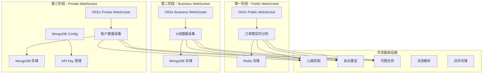
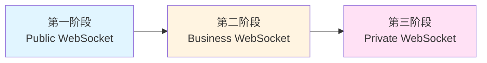

# OKEx Buddy 产品需求文档索引

## 项目概述

OKEx Buddy 是一个完整的数据采集和分析系统，通过 WebSocket 实时获取 OKEx 交易平台的数据，为下游应用提供标准化的数据服务。系统采用分阶段开发策略，每个阶段专注于不同的功能模块。

## 开发阶段

### 第一阶段：Public WebSocket - 订单簿实时分析系统

**文档**：[PRD_PUBLIC.md](./PRD_PUBLIC.md)

**阶段目标**：构建基于 Public WebSocket 的订单簿实时分析系统，提供市场深度、支撑位/阻力位、大额订单分析等实时市场数据。

**核心功能**：
- 订单簿数据实时获取与处理
- 支撑位与阻力位计算
- 大额订单分布分析与主力多空判断
- 深度异常波动检测
- 流动性萎缩预警
- 基于 Redis 的高性能数据存储

**技术特点**：
- WebSocket 实时数据推送
- 50ms 实时分析响应
- 以数据为中心的架构设计
- 多交易对并行处理（最多10个）
- 心跳机制与自动重连
- 代理连接支持

**数据存储**：
- Redis 作为主要数据存储
- 订单簿快照：`orderbook:{instrument_id}`
- 支撑位/阻力位：`analysis:support_resistance:{instrument_id}`
- 大额订单分析：`analysis:large_orders:{instrument_id}`
- 深度异常：`analysis:depth_anomaly:{instrument_id}`
- 流动性预警：`analysis:liquidity_shrink:{instrument_id}`

**适用场景**：
- 实时市场监控
- 交易策略研究
- 风险管理
- 量化交易

---

### 第二阶段：Business WebSocket - K线数据采集系统

**文档**：[PRD_BUSINESS.md](./PRD_BUSINESS.md)

**阶段目标**：构建基于 Business WebSocket 的 K 线数据采集系统，提供历史和实时的 K 线数据，为技术分析和回测系统提供数据支持。

**核心功能**：
- K 线数据实时获取与处理
- 多时间周期支持（1D、4H、1H、15m）
- 多交易对同时监控
- MongoDB 持久化存储
- 数据去重与覆盖机制

**技术特点**：
- 复用 Public 频道的成熟机制（心跳、重连、代理）
- 异步存储提高性能
- 批量插入优化
- 唯一索引防止数据重复
- 时间范围查询优化

**数据存储**：
- MongoDB 作为主要数据存储
- K 线数据集合：`technical_analysis.candlesticks`

**数据结构**：
```json
{
  "_id": "unique_id",
  "bar": "1D",
  "inst_id": "ETH-USDT-SWAP",
  "timestamp": 1770048000000,
  "open": 2371.07,
  "high": 2385.88,
  "low": 2250.07,
  "close": 2302.14,
  "volume": 50271538.2,
  "vol_ccy": 5027153.82,
  "vol_ccy_quote": 11631549266.17203,
  "confirm": 1,
  "day_of_week": 1,
  "record_dt": "2026-02-03",
  "record_hour": 0
}
```

**适用场景**：
- 技术指标计算
- 策略回测
- 历史数据分析
- 长期趋势研究

---

### 第三阶段：Private WebSocket - 账户数据采集与交易系统

**文档**：[PRD_PRIVATE.md](./PRD_PRIVATE.md)

**阶段目标**：构建基于 Private WebSocket 的账户数据采集与交易系统，提供订单、持仓等实时数据，实现自动交易信号处理与下单功能，为账户监控、风险管理和自动交易系统提供数据支持。

**核心功能**：
- MongoDB 配置表管理 API Key
- Private WebSocket 登录与鉴权
- 订单频道数据采集
- 持仓频道数据采集
- 账户 Greeks 数据采集
- Redis 交易信号消费
- WebSocket 自动下单
- 交易信号记录与追踪

**技术特点**：
- 安全的 API Key 管理（存储在 MongoDB config 集合）
- HMAC SHA256 签名鉴权
- 复用 Public/Business 频道的成熟机制
- 自动重连后重新登录
- 多频道并行订阅
- 敏感信息日志脱敏
- Redis List 信号队列（高性能、支持阻塞消费）
- 客户订单 ID（clOrdId）关联机制
- 信号状态追踪（pending -> processing -> success/failed）

**数据存储**：
- MongoDB 作为主要数据存储
- Redis 作为交易信号队列
- 配置数据集合：`technical_analysis.config`
- 订单数据集合：`technical_analysis.orders`
- 持份数据集合：`technical_analysis.positions`
- 交易信号集合：`technical_analysis.trading_signals`

**Redis Key 设计**：
- List: `trading_signals:{strategy_name}` - 存储交易信号的列表，按策略分组

**配置数据结构**：
```json
{
  "_id": "unique_id",
  "item": "okexAccount",
  "key": "api_key",
  "value": "f2e******9c1",
  "desc": "API Key"
}
```

**适用场景**：
- 账户监控
- 订单管理
- 风险管理
- 自动交易
- 资产管理

---

## 系统架构概览

### 整体架构图



### 技术栈对比

| 组件 | 第一阶段 | 第二阶段 | 第三阶段 |
|------|---------|---------|---------|
| WebSocket 端点 | `ws.okx.com:8443/ws/v5/public` | `ws.okx.com:8443/ws/v5/business` | `ws.okx.com:8443/ws/v5/private` |
| 鉴权要求 | 无需鉴权 | 无需鉴权 | 需要 API Key 鉴权 |
| 主要数据库 | Redis | MongoDB | MongoDB |
| 数据类型 | 实时分析结果 | 历史和实时 K 线 | 订单、持仓数据 |
| 心跳机制 | 支持 | 支持 | 支持 |
| 自动重连 | 支持 | 支持 | 支持 |
| 代理支持 | 支持 | 支持 | 支持 |
| 并发处理 | 最多10个交易对 | 多个交易对 | 多个频道 |

---

## 数据存储架构

### Redis（第一阶段）

| 数据类型 | 键名模式 | 用途 |
|---------|---------|------|
| Hash | `orderbook:{instrument_id}` | 订单簿快照 |
| Hash | `analysis:support_resistance:{instrument_id}` | 支撑位/阻力位 |
| Hash | `analysis:large_orders:{instrument_id}` | 大额订单分析 |
| Hash | `analysis:depth_anomaly:{instrument_id}` | 深度异常波动 |
| Hash | `analysis:liquidity_shrink:{instrument_id}` | 流动性萎缩预警 |

### MongoDB（第二、三阶段）

| 集合名称 | 用途 | 所属阶段 |
|---------|------|---------|
| `technical_analysis.config` | API Key 配置 | 第三阶段 |
| `technical_analysis.candlesticks` | K 线数据 | 第二阶段 |
| `technical_analysis.orders` | 订单数据 | 第三阶段 |
| `technical_analysis.positions` | 持仓数据 | 第三阶段 |

---

## 阶段依赖关系



### 依赖说明

- **第一阶段**：独立开发，无前置依赖
- **第二阶段**：依赖第一阶段的 WebSocket 基础架构（心跳、重连、代理）
- **第三阶段**：依赖第二阶段的 MongoDB 基础架构和 WebSocket 基础架构

---

## 开发计划

### 第一阶段开发计划

**目标**：完成 Public WebSocket 订单簿实时分析系统

**主要任务**：
1. Public WebSocket 客户端开发
2. 订单簿数据获取与解析
3. 实时分析算法实现（支撑位/阻力位、大额订单、深度异常、流动性）
4. Redis 数据存储设计
5. 心跳机制与自动重连
6. 性能优化与测试

**预计工期**：4-6周

**交付物**：
- Public WebSocket 客户端代码
- 实时分析算法模块
- Redis 数据存储模块
- 测试报告
- 部署文档

### 第二阶段开发计划

**目标**：完成 Business WebSocket K 线数据采集系统

**主要任务**：
1. Business WebSocket 客户端开发（复用 Public 架构）
2. K 线数据获取与解析
3. MongoDB 数据存储设计
4. 数据去重与索引优化
5. 多时间周期支持
6. 测试与性能优化

**预计工期**：3-4周

**交付物**：
- Business WebSocket 客户端代码
- K 线数据解析模块
- MongoDB 数据存储模块
- 测试报告
- 部署文档

### 第三阶段开发计划

**目标**：完成 Private WebSocket 账户数据采集系统

**主要任务**：
1. Private WebSocket 客户端开发（复用 Public/Business 架构）
2. MongoDB Config 集合设计
3. 登录鉴权机制实现（HMAC SHA256 签名）
4. 多频道数据解析与存储
5. 安全性设计（敏感信息管理、日志脱敏）
6. 测试与安全审计

**预计工期**：4-5周

**交付物**：
- Private WebSocket 客户端代码
- 登录鉴权模块
- 多频道数据解析模块
- 安全性审计报告
- 测试报告
- 部署文档

---

## 系统特性总结

### 共享特性

所有三个阶段都共享以下特性：

✅ **WebSocket 长连接**
- 基于 Gorilla WebSocket 的稳定连接
- 支持心跳机制（每 25 秒发送 ping）
- 支持 Pong 超时检测（30 秒）

✅ **自动重连机制**
- 连接中断后自动重连
- 指数退避策略
- 最多重连 3 次
- 重连后自动恢复订阅/登录

✅ **代理支持**
- 支持 SOCKS5 代理
- 可配置代理地址
- 代理超时处理

✅ **异步数据存储**
- 异步写入数据库，避免阻塞消息处理
- 批量插入优化
- 错误重试机制

✅ **日志与监控**
- 详细的运行日志
- 状态监控接口
- 错误日志记录

✅ **配置管理**
- 环境变量配置
- 支持热更新
- 灵活的参数配置

### 独有特性

| 特性 | 第一阶段 | 第二阶段 | 第三阶段 |
|------|---------|---------|---------|
| 实时分析算法 | ✅ | ❌ | ❌ |
| 多时间周期 K 线 | ❌ | ✅ | ❌ |
| API Key 鉴权 | ❌ | ❌ | ✅ |
| 敏感信息管理 | ❌ | ❌ | ✅ |
| 订单/持仓数据 | ❌ | ❌ | ✅ |
| 市场深度分析 | ✅ | ❌ | ❌ |

---

## 性能指标

| 指标 | 第一阶段 | 第二阶段 | 第三阶段 |
|------|---------|---------|---------|
| 实时分析响应 | < 50ms | - | - |
| 数据解析时间 | - | < 10ms | < 10ms |
| 数据存储时间 | - | < 50ms | < 50ms |
| 并发处理能力 | 10 个交易对 | 多个交易对 | 多个频道 |
| 系统可用性 | 99.9% | 99.9% | 99.9% |
| 连接恢复时间 | < 1秒 | < 1秒 | < 1秒（含重新登录） |
| 心跳间隔 | 25秒 | 25秒 | 25秒 |

---

## 文档索引

| 文档名称 | 路径 | 说明 |
|---------|------|------|
| PRD 索引（本文档） | [PRD.md](./PRD.md) | 整体项目概览和阶段规划 |
| 第一阶段 PRD | [PRD_PUBLIC.md](./PRD_PUBLIC.md) | Public WebSocket 订单簿实时分析系统 |
| 第二阶段 PRD | [PRD_BUSINESS.md](./PRD_BUSINESS.md) | Business WebSocket K 线数据采集系统 |
| 第三阶段 PRD | [PRD_PRIVATE.md](./PRD_PRIVATE.md) | Private WebSocket 账户数据采集系统 |

---

## 附录

### A. 技术术语表

| 术语 | 说明 |
|------|------|
| WebSocket | HTML5 提供的一种全双工通信协议 |
| Public WebSocket | OKEx 公共频道端点，无需鉴权 |
| Business WebSocket | OKEx 业务频道端点，用于 K 线等数据 |
| Private WebSocket | OKEx 私有频道端点，需要 API Key 鉴权 |
| API Key | OKEx 平台的访问密钥，包含 API Key、Secret Key、Passphrase |
| HMAC SHA256 | 基于哈希的消息认证码算法 |
| Redis | 高性能的键值对存储数据库 |
| MongoDB | 面向文档的 NoSQL 数据库 |
| K 线 | 金融图表的一种类型，显示指定时间段内的开盘价、最高价、最低价和收盘价 |
| 订单簿 | 记录买卖双方订单价格和数量的电子列表 |
| 心跳机制 | 定期发送 ping/pong 消息以保持 WebSocket 连接活跃 |
| 自动重连 | 连接中断后自动尝试重新建立连接的机制 |

### B. 联系方式

如有问题或建议，请联系：
- 产品经理：[待填写]
- 技术负责人：[待填写]
- 项目经理：[待填写]

---

**文档版本**：1.0  
**最后更新**：2026-02-19  
**文档作者**：产品团队  
**审核状态**：已审核
