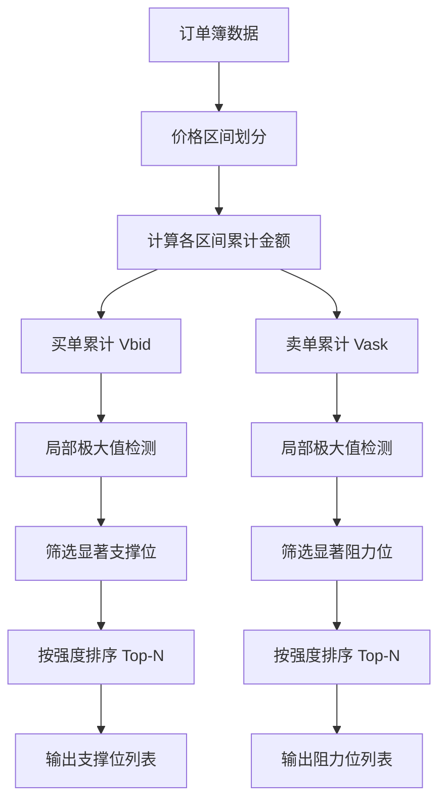
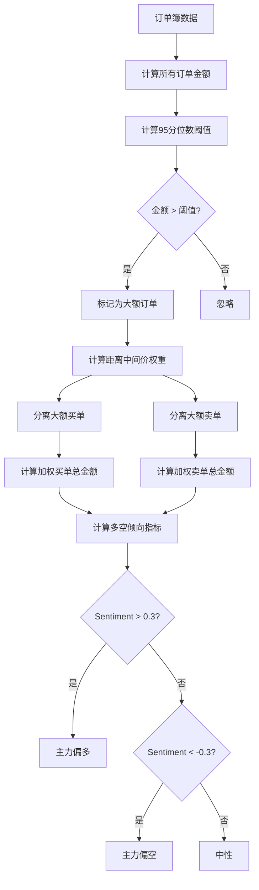
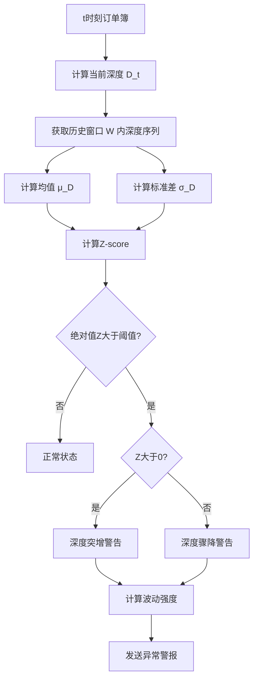
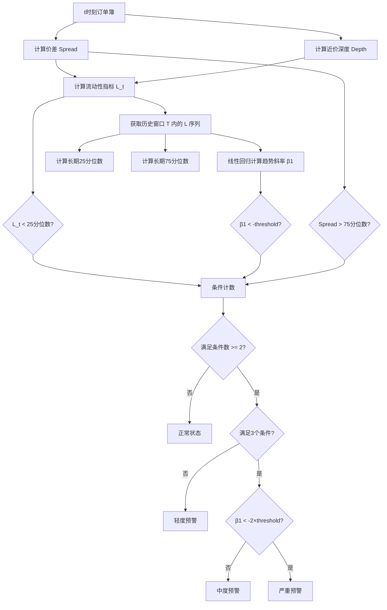

# OKEx订单簿实时分析系统

## 产品需求文档（PRD）

## 1. 文档概述

### 1.1 文档目的

本文档旨在详细描述OKEx订单簿实时分析系统的业务需求、功能特性和性能要求，为产品开发、测试和验收提供明确指导。

### 1.2 适用范围

本文档适用于产品经理、开发团队、测试团队以及相关业务 stakeholders。

### 1.3 术语定义

- **订单簿（Books）**：记录买卖双方订单价格和数量的电子列表
- **交易对**：指两种可交易资产的组合，如BTC-USDT、ETH-BTC等
- **档位**：订单簿中特定价格的买单或卖单
- **快照数据**：某一时刻订单簿的完整状态记录
- **增量推送**：仅推送订单簿与上一状态相比发生变化的数据
- **支撑位**：价格下跌到某一位置时，买盘力量增强，可能阻止价格进一步下跌的价格水平
- **阻力位**：价格上涨到某一位置时，卖盘力量增强，可能阻止价格进一步上涨的价格水平
- **主力**：拥有大量资金、能够影响市场价格的交易者或机构
- **流动性**：市场中资产能够以合理价格快速买卖的能力

## 2. 产品目标

### 2.1 核心目标

为用户提供OKEx交易平台的实时订单簿数据分析服务，帮助用户及时把握市场动态，做出更明智的交易决策。

### 2.2 具体目标

- 实时获取并展示OKEx交易平台的订单簿数据
- 支持最多10个交易对的同时监控
- 提供多种实时数据分析指标，辅助用户进行市场判断
- 及时预警市场异常情况，降低交易风险

## 3. 功能需求

### 3.1 订单簿数据获取

- 系统支持用户选择最多10个OKEx交易对进行同时监控
- 对于每个选定的交易对，系统在首次建立连接时获取其完整的400档订单簿数据
- 初始数据获取完成后，系统持续接收该交易对的订单簿变化数据
- 系统确保每100毫秒至少接收一次增量数据更新

### 3.2 实时数据分析

#### 3.2.1 支撑位与阻力位计算

- 系统根据订单簿中买卖订单的分布情况，实时确定可能的支撑位与阻力位
- 支撑位为价格下跌时可能遇到支撑的价格水平，阻力位为价格上涨时可能遇到阻力的价格水平
- 计算结果应反映当前市场供需关系的真实状态

#### 3.2.2 大额订单分布分析

- 系统能够识别订单簿中的大额订单（具体金额阈值可配置）
- 系统分析大额订单在不同价格区间的分布情况
- 基于大额订单的分布特征，系统判断市场主力可能的多空交易倾向

#### 3.2.3 深度异常波动警告

- 系统持续监测订单簿深度（不同价格区间的订单数量）的变化
- 当某一价格区间的订单数量在短时间内发生显著变化（如快速增加或减少）时，系统触发警告
- 警告应包含异常发生的交易对、价格区间及波动程度等信息

#### 3.2.4 流动性萎缩预警

- 系统实时评估市场流动性状况
- 当订单簿中可交易深度（尤其是靠近当前价格的订单数量）显著减少时，系统触发预警
- 预警应提示用户当前市场流动性风险增加

### 3.3 算法与逻辑详解

#### 3.3.1 支撑位与阻力位计算算法

**算法原理：** 基于订单簿中的价格-数量聚集特征，识别具有显著买卖压力的价格水平。

**计算步骤：**

1. **价格区间划分**
   将订单簿价格范围划分为固定宽度的区间（price bins）：

   $$
   \text{bin\_width} = \frac{P_{\max} - P_{\min}}{N_{\text{bins}}}
   $$

   其中 $P_{\max}$ 和 $P_{\min}$ 分别为订单簿最高和最低价格，$N_{\text{bins}}$ 为区间数量（建议 50-100）。
2. **累计订单量计算**

   对于买单（支撑位）：

   $$
   V_{\text{bid}}(i) = \sum_{p \in \text{bin}_i} \text{size}(p) \times p
   $$

   对于卖单（阻力位）：

   $$
   V_{\text{ask}}(i) = \sum_{p \in \text{bin}_i} \text{size}(p) \times p
   $$

   其中 $\text{size}(p)$ 为价格 $p$ 处的订单数量，累计的是金额（价格×数量）。
3. **显著性识别**

   使用局部极大值检测识别支撑/阻力位：

   $$
   \text{is\_peak}(i) = 
   \begin{cases}
   \text{True} & \text{if } V(i) > \theta \cdot \bar{V} \text{ and } V(i) > V(i-1) \text{ and } V(i) > V(i+1) \\
   \text{False} & \text{otherwise}
   \end{cases}
   $$

   其中 $\bar{V}$ 为平均累计量，$\theta$ 为显著性阈值（建议 1.5-2.0）。
4. **结果排序**

   按累计量降序排序，返回 Top-N（建议 3-5 个）支撑位和阻力位。

**流程图：**

**参数配置：**

- `bin_count`: 50-100（价格区间数量）
- `significance_threshold`: 1.5-2.0（显著性阈值）
- `top_n`: 3-5（返回的支撑/阻力位数量）

---

#### 3.3.2 大额订单分布与主力多空判断算法

**算法原理：** 通过识别大额订单（whale orders）的分布，推断机构或大户的交易意图。

**计算步骤：**

1. **大额订单阈值确定**

   使用订单金额分位数动态确定阈值：

   $$
   \text{threshold} = \text{Percentile}(\{p \times q \mid (p,q) \in \text{Orders}\}, \alpha)
   $$

   其中 $p$ 为价格，$q$ 为数量，$\alpha$ 为分位数（建议 90-95）。
2. **大额订单识别**

   $$
   \text{LargeOrders} = \{(p, q) \mid p \times q > \text{threshold}\}
   $$
3. **价格距离加权**

   越接近当前价格的订单权重越高：

   $$
   w(p) = e^{-\lambda \cdot \frac{|p - P_{\text{mid}}|}{P_{\text{mid}}}}
   $$

   其中 $P_{\text{mid}}$ 为中间价（最优买价和最优卖价的平均），$\lambda$ 为衰减系数（建议 5-10）。
4. **多空力量对比**

   计算加权后的买卖金额：

   $$
   \text{BullPower} = \sum_{(p,q) \in \text{LargeBids}} w(p) \cdot p \cdot q
   $$

   $$
   \text{BearPower} = \sum_{(p,q) \in \text{LargeAsks}} w(p) \cdot p \cdot q
   $$

   多空倾向指标：

   $$
   \text{Sentiment} = \frac{\text{BullPower} - \text{BearPower}}{\text{BullPower} + \text{BearPower}}
   $$

   其中 $\text{Sentiment} \in [-1, 1]$：

   - $> 0.3$：偏多（主力看涨）
   - $[-0.3, 0.3]$：中性
   - $< -0.3$：偏空（主力看跌）

**流程图：**

**参数配置：**

- `percentile_alpha`: 90-95（大额订单百分位阈值）
- `decay_lambda`: 5-10（距离衰减系数）
- `sentiment_threshold`: 0.3（多空判断阈值）

---

#### 3.3.3 深度异常波动检测算法

**算法原理：** 使用时间窗口统计和Z-score检测订单簿深度的突变。

**计算步骤：**

1. **深度指标定义**

   某一价格范围内的总订单量：

   $$
   D(t, r) = \sum_{|p - P_{\text{mid}}(t)| \le r} \text{size}(p, t)
   $$

   其中 $t$ 为时间，$r$ 为价格范围（如当前价格的 ±0.5%）。
2. **滑动窗口统计**

   计算过去 $W$ 个时间点的均值和标准差：

   $$
   \mu_D = \frac{1}{W} \sum_{i=t-W}^{t-1} D(i, r)
   $$

   $$
   \sigma_D = \sqrt{\frac{1}{W} \sum_{i=t-W}^{t-1} (D(i, r) - \mu_D)^2}
   $$
3. **异常检测（Z-score）**

   $$
   Z(t) = \frac{D(t, r) - \mu_D}{\sigma_D}
   $$

   触发条件：

   $$
   \text{Anomaly} = 
   \begin{cases}
   \text{True} & \text{if } |Z(t)| > Z_{\text{threshold}} \\
   \text{False} & \text{otherwise}
   \end{cases}
   $$

   其中 $Z_{\text{threshold}}$ 建议为 2-3（对应 95%-99.7% 置信区间）。
4. **波动方向与强度**

   - $Z(t) > Z_{\text{threshold}}$：深度突增（大量订单涌入）
   - $Z(t) < -Z_{\text{threshold}}$：深度骤降（大量订单撤销）
   - 强度：$|Z(t)|$ 的大小

**流程图：**

**参数配置：**

- `window_size`: 30-60（历史窗口大小，秒数）
- `price_range`: 0.5%-1%（检测的价格范围）
- `z_threshold`: 2-3（Z-score阈值）
- `update_interval`: 600ms（更新频率）

---

#### 3.3.4 流动性萎缩预警算法

**算法原理：** 综合评估订单簿的深度、价差和时间趋势，检测流动性恶化。

**计算步骤：**

1. **流动性指标定义**

   **(a) 有效价差（Effective Spread）**

   $$
   \text{Spread}(t) = \frac{P_{\text{ask}}(t) - P_{\text{bid}}(t)}{P_{\text{mid}}(t)}
   $$

   **(b) 近价深度（Near-Price Depth）**

   距离中间价 $\Delta$ 范围内的订单总量：

   $$
   \text{Depth}(t, \Delta) = \sum_{|p - P_{\text{mid}}(t)| \le \Delta} \text{size}(p, t)
   $$

   **(c) 综合流动性指标**

   $$
   L(t) = \frac{\text{Depth}(t, \Delta)}{1 + \text{Spread}(t)}
   $$

   深度越大、价差越小，流动性越好。
2. **趋势检测（线性回归）**

   在时间窗口 $[t-T, t]$ 内拟合流动性指标的线性趋势：

   $$
   L(i) \approx \beta_0 + \beta_1 \cdot i + \epsilon_i
   $$

   使用最小二乘法计算斜率 $\beta_1$。
3. **萎缩判定条件**

   同时满足以下条件时触发预警：

   **(a) 流动性绝对水平低**

   $$
   L(t) < \text{Percentile}(\{L(i)\}_{i=t-T_{\text{long}}}^{t}, 25)
   $$

   当前流动性低于过去长期窗口（如30分钟）的25分位数。

   **(b) 流动性呈下降趋势**

   $$
   \beta_1 < -\beta_{\text{threshold}}
   $$

   斜率为负且超过阈值（如 $-0.01$）。

   **(c) 价差扩大**

   $$
   \text{Spread}(t) > \text{Percentile}(\{\text{Spread}(i)\}_{i=t-T_{\text{long}}}^{t}, 75)
   $$

   当前价差高于历史75分位数。
4. **预警等级**

   根据满足条件的数量分级：

   - 满足 2 个条件：**轻度预警**
   - 满足 3 个条件：**中度预警**
   - 满足 3 个条件且 $\beta_1 < -2\beta_{\text{threshold}}$：**严重预警**

**流程图：**

**参数配置：**

- `near_price_delta`: 0.5%-1%（近价深度的价格范围）
- `short_window`: 30-60秒（短期趋势窗口）
- `long_window`: 1800秒（长期历史窗口）
- `slope_threshold`: -0.01（趋势斜率阈值）
- `update_interval`: 600ms（更新频率）

---

### 3.4 性能优化策略

为满足 50ms 实时性要求，算法实现需采用以下优化策略：

1. **增量计算**：仅对变化的订单进行更新，避免全量重新计算
2. **内存缓存**：使用循环缓冲区存储历史数据，避免频繁内存分配
3. **并行处理**：多交易对的分析可并行执行（Golang goroutines）
4. **近似算法**：使用滑动窗口均值等近似统计方法替代精确计算
5. **预分配**：预先分配数组和数据结构，减少运行时开销

## 4. 非功能需求

### 4.1 性能要求

- 所有实时数据分析结果应在数据变化发生后50毫秒内完成计算并呈现
- 系统应稳定支持同时监控最多10个交易对的所有功能
- 订单簿数据更新频率应不低于每100毫秒一次
- 系统运行过程中不应出现可感知的卡顿或延迟

### 4.2 可靠性要求

- 系统应具备99.9%以上的可用性，确保在正常市场交易时间内持续运行
- 当与OKEx平台的连接临时中断后，系统应在1秒内自动尝试重新连接
- 网络恢复后，系统应自动重新获取完整订单簿数据并恢复正常分析功能
- 数据处理过程中应确保数据的完整性和准确性，避免因系统原因导致的数据错误

### 4.3 可用性要求

- 系统应提供直观的界面，便于用户查看和理解实时分析结果
- 警告和预警信息应清晰可见，并包含关键信息以便用户快速决策
- 用户应能方便地添加或移除监控的交易对

### 4.4 可扩展性要求

- 系统设计应考虑未来支持更多交易对的监控需求
- 应能灵活添加新的数据分析指标和预警类型

### 4.5 安全性要求

- 系统应确保用户数据和配置信息的安全存储
- 与OKEx平台的通信应遵循相关安全规范

## 5. 用户故事

### 5.1 交易员用户故事

作为一名加密货币交易员，
我希望能够同时监控多个交易对的订单簿数据，
以便及时了解市场动态并做出交易决策。

### 5.2 技术分析师用户故事

作为一名技术分析师，
我希望系统能够实时计算支撑位与阻力位，
以便我能够更准确地预测价格走势。

### 5.3 机构投资者用户故事

作为一名机构投资者，
我希望系统能够分析大额订单分布并判断主力多空倾向，
以便我能够更好地把握市场主力动向。

### 5.4 风险管理者用户故事

作为一名风险管理者，
我希望系统能够提供深度异常波动警告和流动性萎缩预警，
以便我能够及时发现市场风险并采取措施。

### 5.5 量化交易员用户故事

作为一名量化交易员，
我希望系统能够提供低延迟的实时分析数据，
以便我能够将这些数据整合到我的交易策略中。

## 6. 验收标准

### 6.1 订单簿数据获取验收标准

- 系统能够成功连接OKEx平台并获取指定交易对的订单簿数据
- 首次连接时能够获取完整的400档订单簿快照
- 后续能够通过增量方式接收订单簿更新数据
- 系统能够同时稳定监控10个交易对
- 数据更新频率不低于每100毫秒一次

### 6.2 支撑位与阻力位计算验收标准

- 系统能够实时计算并更新每个监控交易对的支撑位与阻力位
- 计算结果在数据变化后50毫秒内完成
- 支撑位与阻力位的计算结果符合市场实际情况

### 6.3 大额订单分布分析验收标准

- 系统能够正确识别订单簿中的大额订单
- 能够展示大额订单在不同价格区间的分布情况
- 能够基于大额订单分布提供主力多空倾向判断
- 分析结果在数据变化后50毫秒内完成

### 6.4 深度异常波动警告验收标准

- 系统能够实时监测订单簿深度变化
- 当检测到异常波动时，能够立即触发警告
- 警告信息包含交易对、价格区间及波动程度等关键信息
- 警告在异常发生后50毫秒内发出

### 6.5 流动性萎缩预警验收标准

- 系统能够实时监测市场流动性变化
- 当流动性出现明显萎缩迹象时，能够立即触发预警
- 预警信息包含交易对及流动性变化情况等关键信息
- 预警在异常发生后50毫秒内发出

### 6.6 性能验收标准

- 所有实时分析功能的最大延迟小于50毫秒，平均延迟在30毫秒以下
- 系统在同时监控10个交易对时仍能保持正常性能
- 系统运行过程中无明显卡顿或延迟

### 6.7 可靠性验收标准

- 系统可用性达到99.9%以上
- 网络中断后能够自动重新连接并恢复功能
- 数据处理过程中无数据丢失或错误

## 7. 风险与依赖

### 7.1 业务风险

#### 7.1.1 外部API依赖风险

- OKEx平台API的稳定性和可用性直接影响系统功能
- OKEx平台API数据格式或接口规则的变更可能导致系统无法正常工作
- OKEx平台限制API调用频率可能影响系统数据获取效率

#### 7.1.2 市场风险

- 极端市场行情下，订单簿数据变化可能异常剧烈，增加系统处理压力
- 市场流动性极度萎缩时，数据准确性可能受到影响

#### 7.1.3 数据准确性风险

- 网络延迟或中断可能导致数据不完整或不一致
- 增量数据处理错误可能导致订单簿状态偏离实际情况

#### 7.1.4 分析结果准确性风险

- 支撑位与阻力位、主力多空倾向等分析结果基于算法模型，存在一定的预测误差
- 异常波动和流动性萎缩的判断标准可能需要根据市场情况不断调整

### 7.2 依赖关系

#### 7.2.1 外部依赖

- OKEx交易平台API：系统核心数据来源
- 稳定的网络环境：确保实时数据获取和处理的可靠性

#### 7.2.2 内部依赖

- 数据存储系统：用于临时存储订单簿数据和分析结果
- 告警系统：用于发送异常波动警告和流动性萎缩预警

## 8. 其他

### 8.1 文档更新记录

| 版本 | 更新日期   | 更新内容                                                                                          | 更新人   |
| ---- | ---------- | ------------------------------------------------------------------------------------------------- | -------- |
| 1.0  | 2025-12-31 | 初始版本                                                                                          | 产品经理 |
| 1.1  | 2026-01-01 | 添加算法与逻辑详解章节，包含支撑/阻力位、大额订单分析、深度异常波动、流动性萎缩的数学公式和流程图 | 技术团队 |

### 8.2 审批记录

| 角色       | 审批状态 | 审批日期 | 审批意见 |
| ---------- | -------- | -------- | -------- |
| 产品总监   | 待审批   |          |          |
| 技术总监   | 待审批   |          |          |
| 业务负责人 | 待审批   |          |          |
