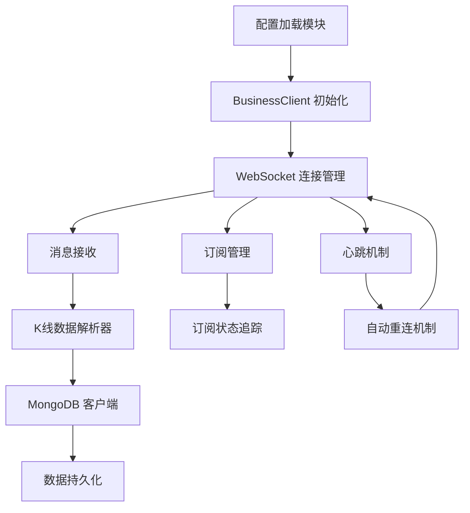
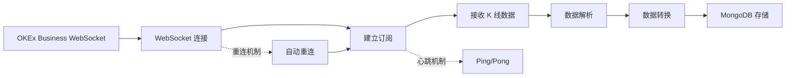
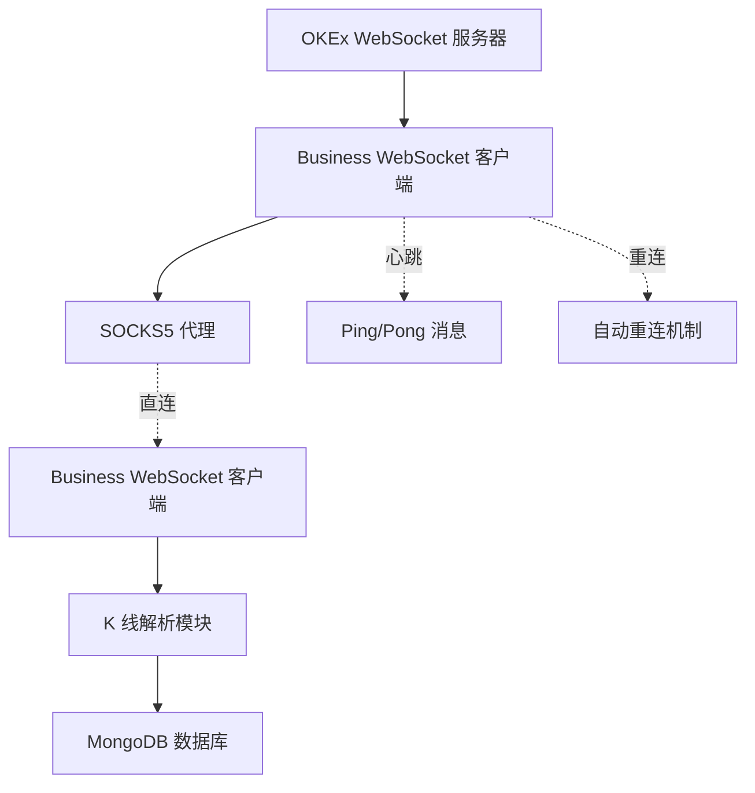

# OKEx Business WebSocket 实时K线数据采集系统

## 产品需求文档（PRD）

## 1. 文档概述

### 1.1 文档目的

本文档旨在详细描述 OKEx Business WebSocket 实时K线（蜡烛图）数据采集系统的业务需求、功能特性和技术架构。该系统是 **独立的数据采集服务**，通过 WebSocket 实时获取 OKEx 平台的 K 线数据，将所有数据持久化到 MongoDB 中，为历史数据分析、技术指标计算和回测系统提供标准化的数据源。

### 1.2 适用范围

本文档适用于产品经理、开发团队、测试团队以及相关业务 stakeholders。

### 1.3 术语定义

- **K线（Candlestick）**：金融图表的一种类型，显示指定时间段内的开盘价、最高价、最低价和收盘价
- **时间周期（Timeframe）**：K线的时间间隔，如1天（1D）、4小时（4H）、1小时（1H）、15分钟（15m）等
- **交易对（Instrument）**：指两种可交易资产的组合，如 BTC-USDT、ETH-USDT-SWAP 等
- **Business WebSocket**：OKEx 提供的专用 WebSocket 端点，用于推送业务数据（如 K 线、成交明细等）
- **MongoDB**：面向文档的 NoSQL 数据库，用于存储结构化数据
- **数据持久化**：将获取的数据保存到持久存储介质（如 MongoDB）的过程
- **心跳机制（Heartbeat）**：定期发送 ping/pong 消息以保持 WebSocket 连接活跃
- **代理连接（Proxy）**：通过中间服务器转发网络请求的连接方式
- **自动重连（Auto-reconnect）**：连接中断后自动尝试重新建立连接的机制

## 2. 产品目标

### 2.1 核心目标

作为独立的数据采集服务，通过 WebSocket 实时获取 OKEx 交易平台的 K 线数据，将所有数据持久化到 MongoDB 中，为历史数据分析、技术指标计算和回测系统提供标准化的数据源。

### 2.2 具体目标

- 实时获取并存储 OKEx 平台的 K 线数据
- 支持多个交易对的同时监控和数据采集
- 支持多种时间周期的 K 线数据采集
- 确保数据的完整性和准确性，避免数据丢失
- 提供稳定的连接机制，支持自动重连和心跳保持
- 为下游应用提供高效的数据访问接口

## 3. 功能需求

### 3.1 K线数据获取与处理

- 系统支持配置多个 OKEx 交易对进行同时监控和数据采集
- 系统在首次建立连接时订阅指定交易对和指定时间周期的 K 线数据
- 系统持续接收该交易对的 K 线数据更新
- 系统确保实时接收到 OKEx 推送的 K 线数据
- 系统对接收的 K 线数据进行标准化处理，统一数据格式
- 标准化后的数据将被存储到 MongoDB 中供后续查询

### 3.2 支持的时间周期

系统支持以下时间周期的 K 线数据采集：

| 时间周期 | 代码 | 用途 |
|---------|------|------|
| 1天 | candle1D | 日线分析、长期趋势判断 |
| 4小时 | candle4H | 中期趋势分析、波段交易 |
| 1小时 | candle1H | 短期趋势分析、日内交易 |
| 15分钟 | candle15m | 短期波动分析、高频交易 |

### 3.3 数据存储策略

#### 3.3.1 MongoDB 集合设计

**集合名称**：`technical_analysis.candlesticks`

**数据结构**：

```json
{
  "_id": "698328eb9e29defc407ad7d2",
  "bar": "1D",
  "inst_id": "ETH-USDT-SWAP",
  "timestamp": 1770048000000,
  "close": 2302.14,
  "confirm": 1,
  "day_of_week": 1,
  "high": 2385.88,
  "low": 2250.07,
  "open": 2371.07,
  "record_dt": "2026-02-03",
  "record_hour": 0,
  "vol_ccy": 5027153.82,
  "vol_ccy_quote": 11631549266.17203,
  "volume": 50271538.2
}
```

**字段说明**：

| 字段名 | 类型 | 说明 | 示例 |
|--------|------|------|
| _id | String | MongoDB 文档唯一标识（自动生成） | "698328eb9e29defc407ad7d2" |
| bar | String | K线时间周期 | "1D", "4H", "1H", "15m" |
| inst_id | String | 交易对标识 | "ETH-USDT-SWAP", "BTC-USDT" |
| timestamp | Int64 | K线开始时间戳（毫秒） | 1770048000000 |
| open | Float64 | 开盘价 | 2371.07 |
| high | Float64 | 最高价 | 2385.88 |
| low | Float64 | 最低价 | 2250.07 |
| close | Float64 | 收盘价 | 2302.14 |
| volume | Float64 | 成交量（基础货币） | 50271538.2 |
| vol_ccy | Float64 | 成交额（基础货币） | 5027153.82 |
| vol_ccy_quote | Float64 | 成交额（计价货币） | 11631549266.17203 |
| confirm | Int | K线确认状态（0未确认，1已确认） | 1 |
| day_of_week | Int | 星期几（0=周一，6=周日） | 1 |
| record_dt | String | 记录日期（YYYY-MM-DD） | "2026-02-03" |
| record_hour | Int | 记录小时（0-23） | 0 |

#### 3.3.2 数据去重策略

- **唯一索引**：在 `inst_id`、`bar`、`timestamp` 字段上创建唯一索引，避免重复存储
- **覆盖策略**：对于同一时间点的数据，后到的数据覆盖先前的数据，确保数据准确性
- **确认机制**：根据 `confirm` 字段判断 K 线是否已最终确认

#### 3.3.3 数据查询优化

- **时间范围查询**：支持按时间范围查询 K 线数据
- **交易对查询**：支持按交易对筛选数据
- **多周期查询**：支持同时查询多个时间周期的数据
- **分页支持**：支持分页查询，避免一次性返回大量数据

### 3.4 连接管理

#### 3.4.1 WebSocket 连接

- **端点配置**：支持配置 OKEx Business WebSocket 端点地址
- **握手超时**：连接握手超时设置为 10 秒
- **并发连接**：支持 Public 和 Business WebSocket 同时运行

#### 3.4.2 心跳机制

- **心跳间隔**：每 25 秒发送一次 ping 消息
- **Pong 超时**：30 秒内未收到 pong 视为连接异常
- **自动断开**：心跳失败时自动断开连接并触发重连
- **日志记录**：记录心跳发送和接收状态，便于故障排查

#### 3.4.3 自动重连

- **重连延迟**：首次重连延迟 5 秒，后续采用指数退避策略
- **最大重连次数**：最多尝试 3 次重连
- **重连成功后**：自动重新订阅所有交易对和时间周期
- **重连失败处理**：达到最大重连次数后停止重连，记录错误日志

#### 3.4.4 代理支持

- **代理配置**：支持配置 SOCKS5 代理地址
- **代理可选**：支持启用或禁用代理连接
- **代理超时**：代理连接超时设置为 10 秒
- **错误处理**：代理连接失败时记录详细错误信息

### 3.5 订阅管理

#### 3.5.1 订阅请求

- **批量订阅**：支持一次性订阅多个交易对和多个时间周期
- **订阅参数**：根据 OKEx API 规范构造订阅消息

**订阅消息格式**：

```json
{
  "op": "subscribe",
  "args": [
    {
      "channel": "candle1D",
      "instId": "ETH-USDT-SWAP"
    },
    {
      "channel": "candle4H",
      "instId": "ETH-USDT-SWAP"
    },
    {
      "channel": "candle1H",
      "instId": "ETH-USDT-SWAP"
    },
    {
      "channel": "candle15m",
      "instId": "ETH-USDT-SWAP"
    }
  ]
}
```

#### 3.5.2 取消订阅

- **批量取消**：支持一次性取消多个交易对和多个时间周期的订阅
- **清理追踪**：取消订阅后从追踪列表中移除对应的交易对

**取消订阅消息格式**：

```json
{
  "op": "unsubscribe",
  "args": [
    {
      "channel": "candle1D",
      "instId": "ETH-USDT-SWAP"
    }
  ]
}
```

#### 3.5.3 订阅状态追踪

- **订阅列表**：维护当前订阅的交易对和时间周期列表
- **状态查询**：支持查询当前订阅状态
- **重复订阅防护**：避免重复订阅同一交易对和时间周期

### 3.6 消息处理

#### 3.6.1 消息解析

- **数据格式解析**：解析 OKEx WebSocket 返回的 K 线数据格式
- **错误处理**：处理消息解析过程中的异常情况
- **日志记录**：记录解析失败的消息内容，便于故障排查

**OKEx K 线数据格式**：

```json
{
  "arg": {
    "channel": "candle1D",
    "instId": "BTC-USDT"
  },
  "data": [
    [
      "1629993600000",
      "42500",
      "48199.9",
      "41006.1",
      "41006.1",
      "3587.41204591",
      "166741046.22583129",
      "166741046.22583129",
      "0"
    ]
  ]
}
```

**数据字段映射**：

| OKEx 字段 | MongoDB 字段 | 说明 |
|-----------|-------------|------|
| data[0] | timestamp | 时间戳（毫秒） |
| data[1] | open | 开盘价 |
| data[2] | high | 最高价 |
| data[3] | low | 最低价 |
| data[4] | close | 收盘价 |
| data[5] | volume | 成交量 |
| data[6] | vol_ccy | 成交额（基础货币） |
| data[7] | vol_ccy_quote | 成交额（计价货币） |
| data[8] | confirm | 确认状态 |

#### 3.6.2 数据转换

- **时间戳转换**：将毫秒时间戳转换为 MongoDB 使用的格式
- **日期计算**：根据时间戳计算星期几和日期字符串
- **数值转换**：确保所有数值字段使用 Float64 类型
- **空值处理**：处理可能的空值或无效值情况

#### 3.6.3 异步存储

- **批量插入**：支持批量插入多条 K 线数据，提高存储效率
- **异步写入**：使用异步方式写入 MongoDB，避免阻塞消息处理
- **错误重试**：存储失败时进行有限次数的重试
- **失败日志**：记录存储失败的数据，便于后续补偿

### 3.7 系统架构

#### 3.7.1 组件架构



#### 3.7.2 数据流



#### 3.7.3 模块说明

| 模块 | 职责 | 输出 |
|------|------|------|
| 配置加载模块 | 从环境变量加载配置 | 配置对象 |
| BusinessClient | 管理 WebSocket 连接、订阅、心跳、重连 | 消息数据 |
| K线解析器 | 解析 OKEx K 线数据格式 | 标准化 K 线对象 |
| MongoDB 客户端 | 管理 MongoDB 连接、数据存储 | 存储结果 |
| 消息处理器 | 协调各个模块处理消息 | 无 |

## 4. 非功能需求

### 4.1 性能要求

- **实时性**：K 线数据应在收到后 100 毫秒内完成解析和存储
- **并发能力**：系统应支持同时处理多个交易对的 K 线数据
- **存储效率**：批量插入操作应能在 50 毫秒内完成
- **内存占用**：系统运行时内存占用应保持在合理范围

### 4.2 可靠性要求

- **连接稳定性**：在正常网络环境下，WebSocket 连接应保持稳定
- **数据完整性**：确保每条 K 线数据都能正确存储，不丢失数据
- **自动恢复**：连接中断后应在 30 秒内自动恢复
- **错误处理**：所有异常情况都应有适当的错误处理和日志记录

### 4.3 可用性要求

- **配置灵活性**：支持通过环境变量配置所有关键参数
- **日志清晰**：提供详细的运行日志，便于故障排查
- **状态监控**：支持查询当前连接和订阅状态

### 4.4 可扩展性要求

- **交易对扩展**：系统设计应支持未来添加更多交易对的监控
- **时间周期扩展**：支持未来添加更多时间周期的 K 线采集
- **存储扩展**：MongoDB 数据结构应支持未来添加新字段

### 4.5 安全性要求

- **代理支持**：支持通过代理连接，保护真实 IP 地址
- **配置安全**：敏感配置信息（如代理地址）应通过环境变量管理
- **数据验证**：对接收的数据进行验证，防止注入攻击

## 5. 技术架构

### 5.1 技术栈

| 组件 | 技术选型 | 说明 |
|------|---------|------|
| 编程语言 | Go 1.23 | 高性能、并发支持好 |
| WebSocket 客户端 | Gorilla WebSocket | 成熟、稳定的 Go WebSocket 库 |
| 数据库 | MongoDB | 文档型数据库，适合存储 K 线数据 |
| 代理支持 | golang.org/x/net/proxy | 支持 SOCKS5 代理 |
| 配置管理 | 环境变量 | 灵活、安全 |

### 5.2 关键设计决策

#### 5.2.1 为什么选择 MongoDB？

**决策**：使用 MongoDB 存储 K 线数据

**理由**：
- **文档型数据库**：K 线数据结构复杂且可能经常变化，文档型数据库更灵活
- **查询能力**：MongoDB 支持复杂的查询和聚合操作
- **水平扩展**：MongoDB 支持分片，适合大规模数据存储
- **索引支持**：MongoDB 提供强大的索引功能，支持高效的时间范围查询

#### 5.2.2 为什么使用心跳机制？

**决策**：实现 WebSocket 心跳机制

**理由**：
- **连接保持**：长时间无数据传输时，心跳可以保持连接活跃
- **异常检测**：通过心跳可以快速检测连接是否断开
- **自动恢复**：连接断开后可以立即触发重连机制
- **最佳实践**：符合 WebSocket 长连接的最佳实践

#### 5.2.3 为什么使用异步存储？

**决策**：使用异步方式存储 K 线数据

**理由**：
- **不阻塞消息处理**：避免因数据库慢操作影响数据接收
- **提高吞吐量**：异步存储可以并行处理多个写入操作
- **错误隔离**：数据库错误不会影响消息接收和解析
- **性能优化**：批量操作可以提高数据库写入效率

### 5.3 部署架构



**部署模式**：
- **独立进程**：Business WebSocket 作为独立进程运行
- **配置管理**：通过环境变量管理所有配置
- **日志输出**：标准输出日志，便于日志收集和分析
- **优雅关闭**：支持信号处理，优雅关闭连接和资源

## 6. 用户故事

### 6.1 数据采集用户故事

**作为**数据分析师
**我想要**获取 ETH-USDT-SWAP 的历史 K 线数据
**以便于**进行技术分析和回测

**验收标准**：
- [ ] 系统能够成功连接到 OKEx Business WebSocket
- [ ] 系统能够订阅 ETH-USDT-SWAP 的多个时间周期
- [ ] 系统能够实时接收并存储 K 线数据
- [ ] MongoDB 中能够查询到完整的 K 线历史数据

### 6.2 多交易对监控用户故事

**作为**量化交易研究员
**我想要**同时监控多个交易对的 K 线数据
**以便于**进行跨市场分析和策略研究

**验收标准**：
- [ ] 系统能够同时订阅多个交易对
- [ ] 每个交易对的 K 线数据都能正确存储
- [ ] 系统能够区分不同交易对的数据
- [ ] 查询时能够按交易对筛选数据

### 6.3 系统稳定性用户故事

**作为**运维工程师
**我想要**确保系统长时间稳定运行
**以便于**保障数据采集的连续性和完整性

**验收标准**：
- [ ] 系统具备心跳机制，长时间无数据时保持连接
- [ ] 系统具备自动重连机制，连接断开后能自动恢复
- [ ] 系统具备详细的日志记录，便于故障排查
- [ ] 系统能够通过代理连接，保护服务器 IP

## 7. 验收标准

### 7.1 功能验收

- [ ] 能够成功连接到 OKEx Business WebSocket 端点
- [ ] 能够订阅指定交易对的多个时间周期
- [ ] 能够实时接收 K 线数据推送
- [ ] 能够正确解析 K 线数据格式
- [ ] 能够将 K 线数据存储到 MongoDB
- [ ] 心跳机制能够正常工作
- [ ] 自动重连机制能够正常工作
- [ ] 代理连接功能能够正常工作

### 7.2 性能验收

- [ ] K 线数据解析时间不超过 10 毫秒
- [ ] K 线数据存储时间不超过 50 毫秒
- [ ] 系统能够支持至少 10 个交易对的同时监控
- [ ] 系统内存占用保持在合理范围（< 500MB）

### 7.3 稳定性验收

- [ ] 系统能够连续运行 24 小时无中断
- [ ] 网络抖动时系统能够自动恢复
- [ ] 所有错误情况都有适当的日志记录
- [ ] 数据完整性检查通过，无数据丢失

### 7.4 数据质量验收

- [ ] MongoDB 中的数据格式正确
- [ ] 所有字段都有正确的数据类型
- [ ] 时间戳转换正确
- [ ] 日期和星期几计算正确
- [ ] 去重机制正常工作

## 8. 风险与缓解

### 8.1 技术风险

| 风险 | 影响 | 缓解措施 |
|------|------|---------|
| WebSocket 连接不稳定 | 数据采集中断 | 实现自动重连机制，增加重连次数 |
| MongoDB 存储性能瓶颈 | 数据延迟 | 使用批量插入，创建适当索引 |
| 内存占用过高 | 系统崩溃 | 限制缓存数据量，使用流式处理 |
| 代理连接失败 | 无法连接到 OKEx | 支持直连模式，提供详细错误日志 |

### 8.2 业务风险

| 风险 | 影响 | 缓解措施 |
|------|------|---------|
| 数据丢失 | 历史数据不完整 | 实现数据去重和覆盖机制 |
| 数据重复 | 存储空间浪费 | 创建唯一索引，避免重复插入 |
| 时间戳错误 | 数据分析不准确 | 严格验证时间戳格式和范围 |
| OKEx API 变更 | 系统功能异常 | 保持代码灵活，快速适应 API 变化 |

## 9. 未来扩展

### 9.1 短期扩展（3-6个月）

- 支持更多时间周期的 K 线数据采集（如 5m、30m、2H、8H、1W）
- 支持历史数据补全功能，从 OKEx API 获取历史 K 线
- 支持数据质量监控，检测异常数据和缺失数据
- 支持数据导出功能，导出为 CSV 或 JSON 格式

### 9.2 长期扩展（6-12个月）

- 支持多个交易所的 K 线数据采集
- 支持自定义数据存储策略（如按交易对分库）
- 支持数据压缩和归档
- 支持实时数据流接口，为下游系统提供实时数据推送

## 10. 附录

### 10.1 配置参数说明

| 参数名 | 说明 | 默认值 | 可选值 |
|--------|------|---------|--------|
| OKEX_BUSINESS_WS | Business WebSocket 端点地址 | wss://ws.okx.com:8443/ws/v5/business | 任意有效的 WebSocket URL |
| MONGODB_ADDR | MongoDB 连接地址 | mongodb://127.0.0.1:27017 | 任意有效的 MongoDB 连接串 |
| MONGODB_DATABASE | MongoDB 数据库名 | technical_analysis | 任意有效的数据库名 |
| ENABLE_BUSINESS_WS | 是否启用 Business WebSocket | true | true, false |
| USE_PROXY | 是否使用代理 | false | true, false |
| PROXY_ADDR | 代理地址 | 127.0.0.1:4781 | 任意有效的 SOCKS5 代理地址 |

### 10.2 监控指标

| 指标名 | 说明 | 目标值 |
|--------|------|--------|
| 连接状态 | WebSocket 连接是否正常 | 保持连接 |
| 心跳状态 | Ping/Pong 是否正常 | 每秒发送 1 次 |
| 订阅数量 | 当前订阅的交易对数量 | >= 1 |
| 数据接收速率 | 每秒接收的 K 线数量 | 取决于时间周期 |
| 存储速率 | 每秒存储的 K 线数量 | >= 接收速率 |
| 错误率 | 错误次数 / 总操作次数 | < 0.1% |

### 10.3 故障排查指南

**问题 1：连接失败**

**可能原因**：
- 网络不可达
- 代理配置错误
- OKEx 端点地址错误

**排查步骤**：
1. 检查网络连接
2. 验证代理配置
3. 检查 OKEx 端点地址是否正确
4. 查看错误日志

**问题 2：心跳失败**

**可能原因**：
- 网络延迟过高
- 代理连接不稳定
- OKEx 服务器问题

**排查步骤**：
1. 检查网络延迟
2. 尝试禁用代理
3. 查看 OKEx 服务状态
4. 增加心跳超时时间

**问题 3：数据存储失败**

**可能原因**：
- MongoDB 连接失败
- 数据格式错误
- 唯一索引冲突

**排查步骤**：
1. 检查 MongoDB 连接
2. 验证数据格式
3. 检查索引配置
4. 查看存储错误日志

---

**文档版本**：1.0  
**最后更新**：2026-02-19  
**文档作者**：开发团队  
**审核状态**：待审核
