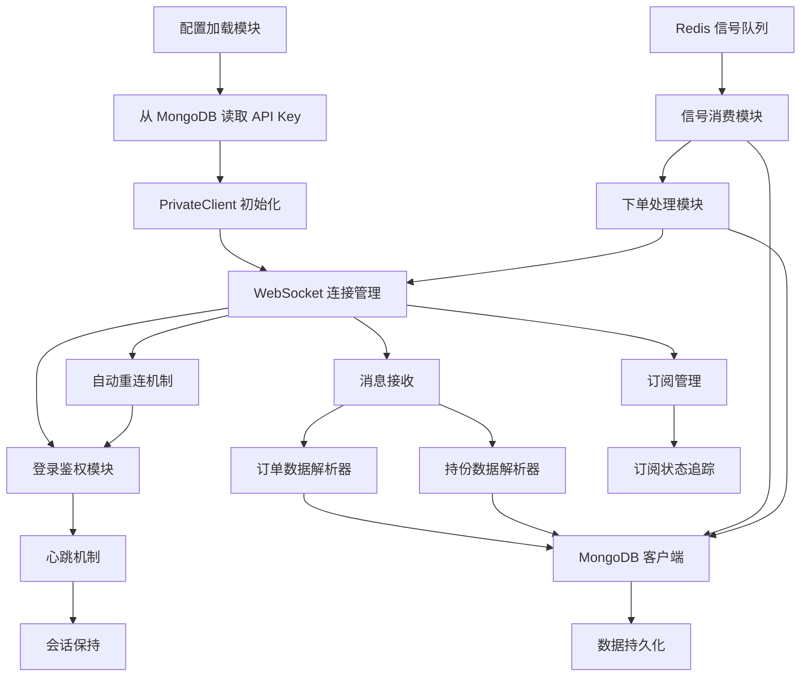
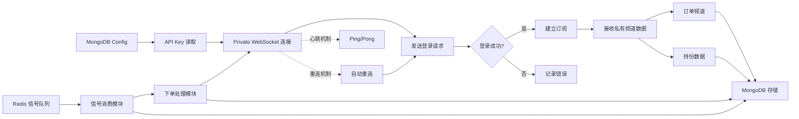
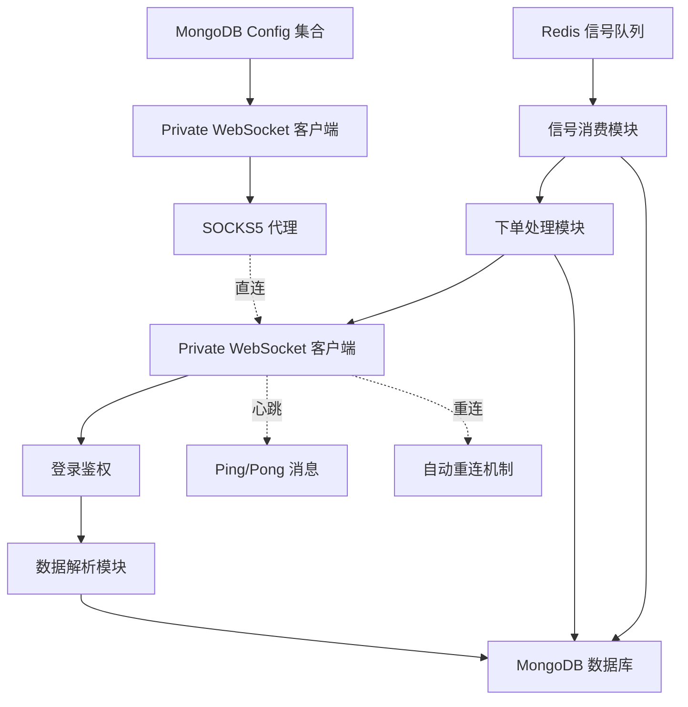

# OKEx Private WebSocket 实时账户数据采集系统

## 产品需求文档（PRD）

## 1. 文档概述

### 1.1 文档目的

本文档旨在详细描述 OKEx Private WebSocket 实时账户数据采集系统的业务需求、功能特性和技术架构。该系统是 **独立的数据采集服务**，通过 WebSocket 实时获取 OKEx 平台的账户数据（订单、持仓、余额等），采用与 Public 和 Business 频道相同的架构设计，从 MongoDB 配置表中读取敏感信息，为账户监控、风险管理和自动交易系统提供标准化的数据源。

### 1.2 适用范围

本文档适用于产品经理、开发团队、测试团队以及相关业务 stakeholders。

### 1.3 术语定义

- **Private WebSocket**：OKEx 提供的专用 WebSocket 端点，用于推送私有数据（如订单、持仓、余额等），需要 API Key 鉴权
- **API Key**：用户在 OKEx 平台创建的访问密钥，包含 API Key、Secret Key 和 Passphrase
- **MongoDB Config 集合**：存储系统配置信息的 MongoDB 集合，包含敏感信息如 API Key 等
- **鉴权（Authentication）**：验证用户身份和权限的过程
- **签名（Signature）**：使用 HMAC SHA256 算法对请求进行加密签名的过程
- **登录（Login）**：通过 API Key、Passphrase 和签名建立 Private WebSocket 连接的过程
- **心跳机制（Heartbeat）**：定期发送 ping/pong 消息以保持 WebSocket 连接活跃
- **自动重连（Auto-reconnect）**：连接中断后自动尝试重新建立连接的机制
- **订单频道（Orders Channel）**：推送订单相关数据（下单、撤单、成交等）
- **持仓频道（Positions Channel）**：推送持仓相关数据
- **Greeks 频道（Greeks Channel）**：推送希腊字母（期权风险指标）数据

## 2. 产品目标

### 2.1 核心目标

作为独立的数据采集服务，通过 WebSocket 实时获取 OKEx 交易平台的账户数据（订单、持仓等），从 MongoDB 配置表中读取 API Key 等敏感信息，从 Redis 消费交易信号并自动下单，采用与 Public 和 Business 频道相同的架构设计，为账户监控、风险管理和自动交易系统提供标准化的数据源。

### 2.2 具体目标

- 从 MongoDB 配置表中安全读取 API Key 信息
- 实现 Private WebSocket 的登录鉴权机制
- 实时获取并存储账户相关数据（订单、持仓等）
- 从 Redis List 消费交易信号并执行自动下单
- 在 MongoDB 中记录交易信号和下单结果
- 复用 Public 和 Business 频道的成熟机制（心跳、自动重连、代理支持）
- 确保敏感信息的安全存储和访问
- 为下游应用提供稳定的账户数据访问接口

## 3. 功能需求

### 3.1 配置管理

#### 3.1.1 MongoDB Config 集合设计

**集合名称**：`technical_analysis.config`

**数据结构**：

```json
{
  "_id": "69956b4690438b25d316f38b",
  "item": "okexAccount",
  "key": "api_key",
  "value": "f2e19abc-3e75-47df-a5f1-8518f8eb89c1",
  "desc": "API Key"
}
```

**字段说明**：

| 字段名 | 类型 | 说明 | 示例 |
|--------|------|------|--------|
| _id | String | MongoDB 文档唯一标识（自动生成） | "6995********f38b" |
| item | String | 配置项标识 | "okexAccount", "api_key", "secret_key", "passphrase" |
| key | String | 配置键名 | "api_key", "secret_key", "passphrase" |
| value | String | 配置值 | "f2e******9c1", "403C******1203", "1!U******ate" |
| desc | String | 配置项描述 | "API Key", "SECRET KEY", "密码" |

#### 3.1.2 配置项定义

| item | key | 说明 | 示例值 |
|------|-----|------|--------|
| okexAccount | api_key | OKEx API Key | "f2e******9c1" |
| okexAccount | secret_key | OKEx Secret Key（用于签名） | "403C******1203" |
| okexAccount | passphrase | OKEx Passphrase | "1!U******ate" |

#### 3.1.3 配置访问策略

- **安全访问**：所有敏感信息通过 MongoDB 查询，不暴露在代码或配置文件中
- **索引设计**：在 `item` 和 `key` 字段上创建唯一索引，支持快速查询
- **缓存机制**：首次加载后缓存配置，避免频繁查询数据库
- **热更新**：支持配置变更后热更新，无需重启服务

### 3.2 Private WebSocket 登录与鉴权

#### 3.2.1 登录流程

根据 OKEx WebSocket 文档，Private WebSocket 连接需要先进行登录鉴权。

**登录请求格式**：

```json
{
  "op": "login",
  "args": [
    {
      "apiKey": "f2e19abc-3e75-47df-a5f1-8518f8eb89c1",
      "passphrase": "1!UJKickTheSteelPlate",
      "timestamp": "2024-12-08T09:08:57.715Z",
      "sign": "HMAC_SHA256_加密的签名"
    }
  ]
}
```

**签名计算**：

```
sign = Base64(HMAC_SHA256(timestamp + 'login' + '', SecretKey))
```

其中：
- `timestamp`：ISO 8601 格式的 UTC 时间戳
- `method`：固定为 "login"
- `requestPath`：固定为空字符串
- `body`：固定为空字符串

**登录响应**：

```json
{
  "event": "login",
  "code": "0",
  "msg": "",
  "data": {
    "result": true
  }
}
```

#### 3.2.2 鉴权验证

- **连接验证**：登录成功后才允许订阅私有频道
- **会话保持**：WebSocket 连接保持期间，会话持续有效
- **超时处理**：连接超时或鉴权失败时，记录错误并触发重连
- **安全日志**：记录登录成功和失败事件，便于安全审计

### 3.3 数据采集需求

#### 3.3.1 支持的频道

根据 OKEx WebSocket 文档，支持以下私有频道：

| 频道名称 | 代码 | 说明 | 数据存储位置 |
|---------|------|------|-------------|
| 订单频道 | orders | 订单相关数据（下单、撤单、成交、委托失败等） | MongoDB 集合 |
| 持仓频道 | positions | 持仓数据（仓位、未实现盈亏等） | MongoDB 集合 |
| 账户 greeks 频道 | account-greeks | 希腊字母数据（期权风险指标） | MongoDB 集合 |

#### 3.3.2 订单频道数据

**数据格式**：

```json
{
  "arg": {
    "channel": "orders",
    "instType": "SWAP"
  },
  "data": [
    {
      "instId": "ETH-USDT-SWAP",
      "ordId": "1234567890123456789",
      "clOrdId": "",
      "tag": "",
      "side": "buy",
      "ordType": "market",
      "posSide": "long",
      "state": "live",
      "tpTriggerPx": "",
      "tpTriggerPxType": "",
      "slTriggerPx": "",
      "slTriggerPxType": "",
      "attachAlgoClOrdId": "",
      "sz": "0.1",
      "px": "2300",
      "reduceOnly": false,
      "cxlOnClose": false,
      "amendPxOnTriggerType": "",
      "tgtCcy": "",
      "attachAlgoOrds": [],
      "ccy": "",
      "lever": "10",
      "tm": "17023456789012",
      "tgtSz": "",
      "accFillSz": "0",
      "avgPx": "",
      "triggerPx": "",
      "triggerPxType": "",
      "cTime": "17023456789012",
      "uTime": "17023456789012",
      "reqId": "1234567890123456789",
      "algoClOrdId": "",
      "algoId": "",
      "fee": "0.00115",
      "fillPx": "",
      "fillSz": "0",
      "fillTime": "",
      "fillNotionalUsd": "0",
      "rebateAmt": "",
      "rebateCcy": "",
      "source": "",
      "category": "normal",
      "pnl": "",
      "pnlRatio": "",
      "takeAlgoPnl": "",
      "takeAlgoPnlRatio": "",
      "takeAlgoPosSide": "",
      "selfTradePrevent": false,
      "quickMgn": "0",
      "quickMgnRatio": "",
      "lever": "10",
      "attachAlgoOrds": []
    }
  ]
}
```

**MongoDB 存储结构**（建议）：

```json
{
  "_id": "unique_order_id",
  "inst_id": "ETH-USDT-SWAP",
  "ord_id": "1234567890123456789",
  "side": "buy",
  "ord_type": "market",
  "pos_side": "long",
  "state": "live",
  "sz": "0.1",
  "px": "2300",
  "lever": "10",
  "tm": "17023456789012",
  "c_time": "17023456789012",
  "u_time": "17023456789012",
  "req_id": "1234567890123456789",
  "fee": "0.00115",
  "fill_sz": "0",
  "fill_px": "",
  "fill_time": "",
  "fill_notional_usd": "0",
  "pnl": "",
  "pnl_ratio": "",
  "category": "normal",
  "timestamp": "17023456789012"
}
```

#### 3.3.3 持仓频道数据

**数据格式**：

```json
{
  "arg": {
    "channel": "positions",
    "instType": "SWAP",
    "instId": "ETH-USDT-SWAP"
  },
  "data": [
    {
      "instId": "ETH-USDT-SWAP",
      "mgnMode": "isolated",
      "posId": "1234567890123456789",
      "posSide": "long",
      "pos": "0.5",
      "baseBal": "0",
      "quoteBal": "0",
      "posCcy": "ETH",
      "pnlRatio": "0.0015",
      "upl": "0",
      "uplRatio": "0",
      "lever": "10",
      "liqPx": "2000",
      "markPx": "2300",
      "optVal": "",
      "deltaBS": "",
      "deltaPA": "",
      "thetaBS": "",
      "thetaPA": "",
      "gammaBS": "",
      "gammaPA": "",
      "vegaBS": "",
      "vegaPA": "",
      "cTime": "1702345678901234",
      "uTime": "1702345678901234",
      "adl": "cross",
      "lever": "10",
      "notionalUsd": "1150",
      "last": "2300"
    }
  ]
}
```

#### 3.3.5 数据存储策略

##### 3.3.5.1 MongoDB 集合设计

**订单数据集合**：`technical_analysis.orders`

**持份数据集合**：`technical_analysis.positions`

**交易信号集合**：`technical_analysis.trading_signals`

##### 3.3.5.2 数据去重策略

- **唯一索引**：在 `ord_id`、`pos_id` 等字段上创建唯一索引
- **覆盖策略**：对于同一订单或持仓，后到的数据覆盖先前的数据
- **增量更新**：仅更新变化的字段，减少数据库负载

##### 3.3.5.3 数据查询优化

- **时间范围查询**：支持按时间范围查询历史数据
- **交易对查询**：支持按交易对筛选数据
- **状态查询**：支持按订单状态、持仓状态筛选数据
- **分页支持**：支持分页查询，避免一次性返回大量数据

### 3.4 连接管理（复用 Public/Business 机制）

#### 3.4.1 WebSocket 连接

- **端点配置**：支持配置 OKEx Private WebSocket 端点地址
- **握手超时**：连接握手超时设置为 10 秒
- **并发连接**：支持 Public、Business 和 Private WebSocket 同时运行

#### 3.4.2 心跳机制（复用）

- **心跳间隔**：每 25 秒发送一次 ping 消息
- **Pong 超时**：30 秒内未收到 pong 视为连接异常
- **自动断开**：心跳失败时自动断开连接并触发重连
- **日志记录**：记录心跳发送和接收状态，便于故障排查

#### 3.4.3 自动重连（复用）

- **重连延迟**：首次重连延迟 5 秒，后续采用指数退避策略
- **最大重连次数**：最多尝试 3 次重连
- **重连成功后**：自动重新登录并重新订阅所有频道
- **重连失败处理**：达到最大重连次数后停止重连，记录错误日志

#### 3.4.4 代理支持（复用）

- **代理配置**：支持配置 SOCKS5 代理地址
- **代理可选**：支持启用或禁用代理连接
- **代理超时**：代理连接超时设置为 10 秒
- **错误处理**：代理连接失败时记录详细错误信息

### 3.5 订阅管理

#### 3.5.1 频道订阅

- **登录后订阅**：登录成功后自动订阅所需频道
- **订阅参数**：根据 OKEx API 规范构造订阅消息

**订阅请求格式**：

```json
{
  "op": "subscribe",
  "args": [
    {
      "channel": "orders",
      "instType": "SWAP"
    },
    {
      "channel": "account",
      "ccy": "USDT",
      "instType": "SWAP"
    },
    {
      "channel": "positions",
      "instType": "SWAP"
    }
  ]
}
```

#### 3.5.2 取消订阅

- **断开前取消**：关闭连接前取消所有频道订阅
- **清理追踪**：取消订阅后从追踪列表中移除对应的频道

### 3.6 交易信号处理与下单

#### 3.6.1 交易信号消费机制

**信号来源**：从 Redis List 中消费交易信号

**Redis Key 设计**：

| Key 类型 | Key 名称 | 说明 |
|---------|----------|------|
| List | `trading_signals:{strategy_name}` | 存储交易信号的列表，按策略分组 |

**信号格式**（JSON）：

```json
{
  "signal_id": "sig_20240219_001",
  "strategy_name": "momentum_strategy",
  "inst_id": "ETH-USDT-SWAP",
  "side": "buy",
  "ord_type": "market",
  "pos_side": "long",
  "sz": "0.1",
  "px": "",
  "reduce_only": false,
  "tp_trigger_px": "",
  "tp_trigger_px_type": "",
  "sl_trigger_px": "",
  "sl_trigger_px_type": "",
  "ccy": "",
  "tag": "",
  "timestamp": 1708387200000
}
```

**字段说明**：

| 字段名 | 类型 | 说明 | 示例 |
|--------|------|------|--------|
| signal_id | String | 信号唯一标识 | "sig_20240219_001" |
| strategy_name | String | 策略名称 | "momentum_strategy" |
| inst_id | String | 交易对 | "ETH-USDT-SWAP" |
| side | String | 订单方向（buy/sell） | "buy" |
| ord_type | String | 订单类型（market/limit/post_only/...） | "market" |
| pos_side | String | 持仓方向（long/short/net） | "long" |
| sz | String | 委托数量 | "0.1" |
| px | String | 委托价格（限价单必填） | "" |
| reduce_only | Boolean | 是否只减仓 | false |
| tp_trigger_px | String | 止盈触发价 | "" |
| tp_trigger_px_type | String | 止盈触发价类型 | "" |
| sl_trigger_px | String | 止损触发价 | "" |
| sl_trigger_px_type | String | 止损触发价类型 | "" |
| ccy | String | 保证金币种 | "" |
| tag | String | 订单标签 | "" |
| timestamp | Int64 | 信号时间戳 | 1708387200000 |

**消费策略**：

- **阻塞消费**：使用 `BLPOP` 或 `BRPOP` 命令阻塞等待新信号
- **超时设置**：设置合理的超时时间（如 5 秒），避免永久阻塞
- **多策略支持**：支持同时消费多个策略的信号列表
- **错误处理**：消费失败时记录错误日志，避免信号丢失
- **信号验证**：在处理前验证信号格式和参数合法性

#### 3.6.2 信号记录表设计

**集合名称**：`technical_analysis.trading_signals`

**数据结构**：

```json
{
  "_id": "signal_20240219_001",
  "signal_id": "sig_20240219_001",
  "strategy_name": "momentum_strategy",
  "inst_id": "ETH-USDT-SWAP",
  "side": "buy",
  "ord_type": "market",
  "pos_side": "long",
  "sz": "0.1",
  "px": "",
  "reduce_only": false,
  "status": "pending",
  "ord_id": "",
  "cl_ord_id": "",
  "error_msg": "",
  "signal_timestamp": 1708387200000,
  "process_timestamp": 1708387200100,
  "order_timestamp": 1708387200200,
  "created_at": "2026-02-19T10:00:00.000Z",
  "updated_at": "2026-02-19T10:00:02.000Z"
}
```

**字段说明**：

| 字段名 | 类型 | 说明 | 示例 |
|--------|------|------|--------|
| _id | String | MongoDB 文档唯一标识 | "signal_20240219_001" |
| signal_id | String | 信号唯一标识 | "sig_20240219_001" |
| strategy_name | String | 策略名称 | "momentum_strategy" |
| inst_id | String | 交易对 | "ETH-USDT-SWAP" |
| side | String | 订单方向 | "buy" |
| ord_type | String | 订单类型 | "market" |
| pos_side | String | 持仓方向 | "long" |
| sz | String | 委托数量 | "0.1" |
| px | String | 委托价格 | "" |
| reduce_only | Boolean | 是否只减仓 | false |
| status | String | 信号状态 | "pending" |
| ord_id | String | OKEx 订单ID | "1234567890123456789" |
| cl_ord_id | String | 客户订单ID | "client_20240219_001" |
| error_msg | String | 错误信息 | "" |
| signal_timestamp | Int64 | 信号生成时间戳 | 1708387200000 |
| process_timestamp | Int64 | 信号处理时间戳 | 1708387200100 |
| order_timestamp | Int64 | 下单成功时间戳 | 1708387200200 |
| created_at | String | 记录创建时间 | "2026-02-19T10:00:00.000Z" |
| updated_at | String | 记录更新时间 | "2026-02-19T10:00:02.000Z" |

**信号状态枚举**：

| 状态值 | 说明 |
|--------|------|
| pending | 待处理（刚从 Redis 消费） |
| processing | 处理中（已发送下单请求） |
| success | 下单成功 |
| failed | 下单失败 |
| rejected | 信号被拒绝（参数验证失败） |

**索引设计**：

- 在 `signal_id` 字段上创建唯一索引
- 在 `status` 字段上创建索引，便于状态查询
- 在 `strategy_name` 字段上创建索引，便于按策略查询
- 在 `signal_timestamp` 字段上创建索引，便于时间范围查询

#### 3.6.3 WS 下单机制

**下单请求格式**：

```json
{
  "op": "order",
  "args": [
    {
      "instId": "ETH-USDT-SWAP",
      "tdMode": "cross",
      "clOrdId": "client_20240219_001",
      "side": "buy",
      "ordType": "market",
      "posSide": "long",
      "sz": "0.1",
      "reduceOnly": false,
      "tag": "momentum_strategy"
    }
  ]
}
```

**下单流程**：

1. **信号验证**
   - 验证信号格式是否正确
   - 验证必需字段是否存在
   - 验证参数合法性（如数量、价格范围等）

2. **生成客户订单ID**
   - 根据 `signal_id` 生成唯一的 `cl_ord_id`
   - 格式建议：`client_{timestamp}_{sequence}`

3. **记录信号**
   - 在 MongoDB `trading_signals` 集合中插入信号记录
   - 状态设置为 "pending"

4. **发送下单请求**
   - 构造下单请求消息
   - 通过 WebSocket 发送到 OKEx
   - 更新信号状态为 "processing"

5. **处理下单响应**
   - 成功：更新信号状态为 "success"，记录 `ord_id` 和 `order_timestamp`
   - 失败：更新信号状态为 "failed"，记录错误信息

6. **订单关联**
   - 通过 `cl_ord_id` 将下单请求与订单频道返回的订单关联
   - 更新订单记录中的信号关联信息

**下单响应**（成功）：

```json
{
  "event": "order",
  "arg": {
    "channel": "orders",
    "instType": "SWAP"
  },
  "data": [
    {
      "instId": "ETH-USDT-SWAP",
      "ordId": "1234567890123456789",
      "clOrdId": "client_20240219_001",
      "tag": "momentum_strategy",
      "side": "buy",
      "ordType": "market",
      "posSide": "long",
      "sz": "0.1",
      "px": "",
      "state": "live",
      "lever": "10",
      "tm": "1708387200200",
      "cTime": "1708387200200",
      "uTime": "1708387200200"
    }
  ]
}
```

**下单响应**（失败）：

```json
{
  "event": "error",
  "code": "51001",
  "msg": "Parameter error",
  "data": ""
}
```

#### 3.6.4 订单关联与状态同步

**关联机制**：

- **客户订单ID（clOrdId）**：作为下单请求与订单返回的关联键
- **双向关联**：
  - 信号记录中存储 `cl_ord_id` 和 `ord_id`
  - 订单记录中存储 `cl_ord_id` 和 `signal_id`

**状态同步**：

1. **订阅订单频道**
   - 确保订单频道已订阅，以接收订单状态更新

2. **监听订单更新**
   - 监听订单频道推送的消息
   - 匹配 `cl_ord_id` 找到对应的信号记录

3. **更新信号状态**
   - 订单状态变化时（如从 "live" 变为 "filled"）
   - 更新信号记录的 `status` 和 `updated_at`

4. **错误处理**
   - 订单被拒绝时，更新信号状态为 "failed"
   - 订单被撤销时，记录相关信息

#### 3.6.5 错误处理与重试机制

**错误类型**：

| 错误类型 | 处理方式 |
|---------|---------|
| 网络错误 | 记录错误，不重试（信号可能已被其他消费者处理） |
| 参数验证失败 | 状态设为 "rejected"，不重试 |
| OKEx 服务错误 | 根据错误码决定是否重试 |
| 账户余额不足 | 状态设为 "failed"，不重试 |
| 仓位限制 | 状态设为 "failed"，不重试 |

**重试策略**：

- **不重试**：默认情况下不重试，避免重复下单
- **手动重试**：提供接口支持手动重试失败的信号
- **重试配置**：可配置是否启用自动重试及重试次数

**错误日志**：

- 记录详细的错误信息
- 包含信号ID、错误码、错误消息、时间戳
- 便于后续分析和问题排查

### 3.7 消息处理

#### 3.6.1 消息解析

- **数据格式解析**：解析 OKEx WebSocket 返回的私有频道数据格式
- **错误处理**：处理消息解析过程中的异常情况
- **日志记录**：记录解析失败的消息内容，便于故障排查

#### 3.6.2 数据转换

- **时间戳转换**：将毫秒时间戳转换为 MongoDB 使用的格式
- **数值转换**：确保所有数值字段使用 Float64 或 Int64 类型
- **空值处理**：处理可能的空值或无效值情况

#### 3.6.3 异步存储

- **批量插入**：支持批量插入多条数据，提高存储效率
- **异步写入**：使用异步方式写入 MongoDB，避免阻塞消息处理
- **错误重试**：存储失败时进行有限次数的重试
- **失败日志**：记录存储失败的数据，便于后续补偿

### 3.7 系统架构

#### 3.7.1 组件架构



#### 3.7.2 数据流



#### 3.7.3 模块说明

| 模块 | 职责 | 输出 |
|------|------|------|
| 配置加载模块 | 从 MongoDB config 集合读取 API Key | API Key 信息 |
| PrivateClient | 管理 Private WebSocket 连接、登录、订阅、心跳、重连 | 消息数据 |
| 登录鉴权模块 | 处理登录流程和签名计算 | 登录结果 |
| 数据解析器 | 解析各个私有频道的数据格式 | 标准化数据对象 |
| MongoDB 客户端 | 管理 MongoDB 连接、数据存储 | 存储结果 |
| 信号消费模块 | 从 Redis List 消费交易信号 | 信号对象 |
| 下单处理模块 | 处理交易信号，构造下单请求，发送到 WebSocket | 下单结果 |

### 3.8 安全性设计

#### 3.8.1 敏感信息管理

- **数据库存储**：API Key、Secret Key、Passphrase 存储在 MongoDB config 集合中
- **访问控制**：仅应用程序可以访问 MongoDB config 集合
- **传输安全**：WebSocket 连接使用 TLS 加密
- **签名验证**：所有请求使用 HMAC SHA256 签名
- **日志脱敏**：日志中不记录完整的 Secret Key 和 Passphrase

#### 3.8.2 安全最佳实践

- **最小权限原则**：API Key 仅授予必要的权限
- **定期轮换**：建议定期更换 API Key
- **IP 白名单**：建议在 OKEx 配置 IP 白名单
- **监控告警**：记录异常登录和频繁失败尝试

## 4. 非功能需求

### 4.1 性能要求

- **实时性**：私有数据应在收到后 100 毫秒内完成解析和存储
- **并发能力**：系统应支持同时处理多个频道的数据
- **存储效率**：批量插入操作应能在 50 毫秒内完成
- **内存占用**：系统运行时内存占用应保持在合理范围

### 4.2 可靠性要求

- **连接稳定性**：在正常网络环境下，Private WebSocket 连接应保持稳定
- **鉴权可靠性**：登录鉴权机制应具备高可靠性
- **数据完整性**：确保每条数据都能正确存储，不丢失数据
- **自动恢复**：连接中断后应在 30 秒内自动恢复

### 4.3 可用性要求

- **配置灵活性**：支持通过 MongoDB 配置表管理 API Key
- **日志清晰**：提供详细的运行日志，便于故障排查
- **状态监控**：支持查询当前连接和订阅状态

### 4.4 可扩展性要求

- **频道扩展**：系统设计应支持未来添加更多私有频道
- **存储扩展**：MongoDB 数据结构应支持未来添加新字段

### 4.5 安全性要求

- **敏感信息保护**：API Key 等敏感信息安全存储在 MongoDB 中
- **传输加密**：所有网络通信使用 TLS 加密
- **访问审计**：记录所有配置访问和数据读取操作

## 5. 技术架构

### 5.1 技术栈

| 组件 | 技术选型 | 说明 |
|------|---------|------|
| 编程语言 | Go 1.23 | 高性能、并发支持好 |
| WebSocket 客户端 | Gorilla WebSocket | 成熟、稳定的 Go WebSocket 库 |
| 数据库 | MongoDB | 文档型数据库，适合存储配置和账户数据 |
| 缓存和消息队列 | Redis | 高性能的键值对存储，用于交易信号队列 |
| 代理支持 | golang.org/x/net/proxy | 支持 SOCKS5 代理 |
| 配置管理 | MongoDB 集合 | 安全存储敏感信息 |
| 加密算法 | HMAC SHA256 | 签名算法 |

### 5.2 关键设计决策

#### 5.2.1 为什么使用 MongoDB 存储 API Key？

**决策**：使用 MongoDB config 集合存储 API Key

**理由**：
- **安全性**：避免将敏感信息暴露在代码或配置文件中
- **灵活性**：支持动态更新 API Key，无需重启服务
- **集中管理**：所有配置信息集中存储，便于管理
- **访问控制**：可以利用 MongoDB 的访问控制机制

#### 5.2.2 为什么复用 Public/Business 机制？

**决策**：复用 Public 和 Business 频道的成熟机制

**理由**：
- **代码一致性**：保持三个 WebSocket 客户端的代码结构一致
- **维护性**：减少重复代码，降低维护成本
- **稳定性**：复用已经验证的机制（心跳、重连、代理）
- **快速开发**：基于现有代码快速实现 Private 频道

#### 5.2.3 为什么使用 Redis List 作为交易信号队列？

**决策**：使用 Redis List 存储交易信号

**理由**：
- **高性能**：Redis 是内存数据库，读写速度极快，适合高频交易场景
- **可靠性**：Redis 支持持久化，数据不会因重启而丢失
- **解耦**：信号生产者（策略）和消费者（下单模块）解耦，提高系统灵活性
- **阻塞消费**：Redis List 支持 BLPOP/BRPOP 阻塞操作，避免轮询，降低 CPU 使用
- **分布式支持**：Redis 支持分布式部署，多个消费者可以从同一个队列消费
- **队列管理**：天然支持队列特性，先入先出（FIFO），保证信号处理顺序

#### 5.2.4 为什么使用异步存储？

**决策**：使用异步方式存储私有数据

**理由**：
- **不阻塞消息处理**：避免因数据库慢操作影响数据接收
- **提高吞吐量**：异步存储可以并行处理多个写入操作
- **错误隔离**：数据库 错误不会影响消息接收和解析
- **性能优化**：批量操作可以提高数据库写入效率

### 5.3 部署架构



**部署模式**：
- **独立进程**：Private WebSocket 作为独立进程运行
- **配置管理**：通过 MongoDB config 集合管理 API Key
- **日志输出**：标准输出日志，便于日志收集和分析
- **优雅关闭**：支持信号处理，优雅关闭连接和资源

## 6. 用户故事

### 6.1 账户监控用户故事

**作为**交易员
**我想要**实时监控我的持仓和订单
**以便于**及时了解账户状态，做出交易决策

**验收标准**：
- [ ] 系统能够从 MongoDB 读取 API Key
- [ ] 系统能够成功连接到 OKEx Private WebSocket
- [ ] 系统能够成功登录鉴权
- [ ] 系统能够订阅订单和持仓频道
- [ ] 系统能够实时接收并存储订单和持仓数据
- [ ] MongoDB 中能够查询到完整的订单和持仓数据

### 6.2 订单管理用户故事

**作为**量化交易员
**我想要**实时监控我的订单状态和成交情况
**以便于**及时了解订单执行情况，调整交易策略

**验收标准**：
- [ ] 系统能够订阅订单频道
- [ ] 系统能够实时接收订单数据推送
- [ ] 系统能够正确解析订单数据格式
- [ ] 系统能够将订单数据存储到 MongoDB
- [ ] 查询时能够按订单状态筛选数据

### 6.3 交易信号处理用户故事

**作为**量化交易系统
**我想要**自动接收交易信号并执行下单
**以便于**实现自动交易，减少人工干预

**验收标准**：
- [ ] 系统能够从 Redis List 消费交易信号
- [ ] 系统能够验证信号格式和参数合法性
- [ ] 系统能够在 MongoDB 中记录交易信号
- [ ] 系统能够通过 WebSocket 发送下单请求
- [ ] 系统能够正确处理下单响应
- [ ] 系统能够将下单请求与订单频道返回的订单关联
- [ ] 系统能够更新信号状态（pending -> processing -> success/failed）
- [ ] MongoDB 中能够查询到完整的信号记录

### 6.4 系统稳定性用户故事

**作为**运维工程师
**我想要**确保 Private WebSocket 系统长时间稳定运行
**以便于**保障账户数据采集的连续性和完整性

**验收标准**：
- [ ] 系统具备登录鉴权机制
- [ ] 系统具备心跳机制，长时间无数据时保持连接
- [ ] 系统具备自动重连机制，连接断开后能自动恢复
- [ ] 系统具备详细的日志记录，便于故障排查
- [ ] 系统能够通过代理连接，保护服务器 IP

## 7. 验收标准

### 7.1 功能验收

- [ ] 能够从 MongoDB config 集合读取 API Key
- [ ] 能够成功连接到 OKEx Private WebSocket 端点
- [ ] 能够成功进行登录鉴权
- [ ] 能够订阅订单和持仓频道
- [ ] 能够实时接收私有频道数据推送
- [ ] 能够正确解析私有频道数据格式
- [ ] 能够将私有数据存储到 MongoDB
- [ ] 能够从 Redis List 消费交易信号
- [ ] 能够验证交易信号格式和参数合法性
- [ ] 能够在 MongoDB trading_signals 集合中记录交易信号
- [ ] 能够通过 WebSocket 发送下单请求
- [ ] 能够正确处理下单响应（成功/失败）
- [ ] 能够将下单请求与订单频道返回的订单关联
- [ ] 能够正确更新信号状态（pending -> processing -> success/failed）
- [ ] 心跳机制能够正常工作
- [ ] 自动重连机制能够正常工作（包括重新登录）
- [ ] 代理连接功能能够正常工作

### 7.2 性能验收

- [ ] 私有数据解析时间不超过 10 毫秒
- [ ] 私有数据存储时间不超过 50 毫秒
- [ ] 系统能够支持至少 5 个私有频道的同时监控
- [ ] 系统内存占用保持在合理范围（< 500MB）
- [ ] 信号消费延迟不超过 100 毫秒（从 Redis 消费到开始处理）
- [ ] 下单请求响应时间不超过 500 毫秒
- [ ] 信号处理总时间不超过 1 秒（从消费到记录完成）

### 7.3 稳定性验收

- [ ] 系统能够连续运行 24 小时无中断
- [ ] 网络抖动时系统能够自动恢复（包括重新登录）
- [ ] 所有错误情况都有适当的日志记录
- [ ] 数据完整性检查通过，无数据丢失

### 7.4 数据质量验收

- [ ] MongoDB 中的数据格式正确
- [ ] 所有字段都有正确的数据类型
- [ ] 时间戳转换正确
- [ ] 去重机制正常工作
- [ ] 敏感信息（API Key）安全存储

## 8. 风险与缓解

### 8.1 技术风险

| 风险 | 影响 | 缓解措施 |
|------|------|---------|
| Private WebSocket 连接不稳定 | 数据采集中断 | 实现自动重连机制，增加重连次数 |
| MongoDB 存储性能瓶颈 | 数据延迟 | 使用批量插入，创建适当索引 |
| 内存占用过高 | 系统崩溃 | 限制缓存数据量，使用流式处理 |
| 代理连接失败 | 无法连接到 OKEx | 支持直连模式，提供详细错误日志 |
| 登录鉴权失败 | 无法获取私有数据 | 实现重试机制，记录失败日志 |
| API Key 过期或失效 | 数据采集中断 | 支持动态更新 API Key，提供过期提示 |
| Redis 信号队列积压 | 信号处理延迟 | 监控队列长度，动态调整消费者数量 |
| 下单请求失败 | 交易信号无法执行 | 记录失败原因，提供重试机制 |
| 信号格式错误 | 系统异常 | 严格的信号验证，拒绝无效信号 |

### 8.2 业务风险

| 风险 | 影响 | 缓解措施 |
|------|------|---------|
| 数据丢失 | 账户数据不完整 | 实现数据去重和覆盖机制 |
| 数据重复 | 存储空间浪费 | 创建唯一索引，避免重复插入 |
| 信号重复下单 | 资金损失 | 使用唯一 clOrdId，避免重复下单 |
| 信号参数错误 | 下单失败 | 严格的参数验证，拒绝无效信号 |
| 订单执行失败 | 交易失败 | 完善的错误处理和重试机制 |
| 信号与订单关联失败 | 无法追踪信号状态 | 使用 clOrdId 作为关联键，确保唯一性 |
| 时间戳错误 | 数据分析不准确 | 严格验证时间戳格式和范围 |
| OKEx API 变更 | 系统功能异常 | 保持代码灵活，快速适应 API 变化 |
| 敏感信息泄露 | 安全风险 | 使用 MongoDB 访问控制，日志脱敏 |

## 9. 未来扩展

### 9.1 短期扩展（3-6个月）

- 支持更多私有频道的数据采集（如账户 greeks 频道）
- 支持历史账户数据补全功能，从 OKEx REST API 获取历史数据
- 支持数据质量监控，检测异常数据和缺失数据
- 支持数据导出功能，导出为 CSV 或 JSON 格式

### 9.2 长期扩展（6-12个月）

- 支持多个交易所的私有数据采集
- 支持自定义数据存储策略（如按用户分库）
- 支持数据压缩和归档
- 支持实时数据流接口，为下游系统提供实时数据推送
- 支持智能风控，基于账户数据自动调整风险参数

## 10. 附录

### 10.1 配置参数说明

| 参数名 | 说明 | 默认值 | 可选值 |
|--------|------|---------|--------|
| MONGODB_ADDR | MongoDB 连接地址 | mongodb://127.0.0.1:27017 | 任意有效的 MongoDB 连接串 |
| MONGODB_DATABASE | MongoDB 数据库名 | technical_analysis | 任意有效的数据库名 |
| ENABLE_PRIVATE_WS | 是否启用 Private WebSocket | false | true, false |
| OKEX_PRIVATE_WS | Private WebSocket 端点地址 | wss://ws.okx.com:8443/ws/v5/private | 任意有效的 WebSocket URL |
| USE_PROXY | 是否使用代理 | false | true, false |
| PROXY_ADDR | 代理地址 | 127.0.0.1:4781 | 任意有效的 SOCKS5 代理地址 |

### 10.2 监控指标

| 指标名 | 说明 | 目标值 |
|--------|------|--------|
| 连接状态 | WebSocket 连接是否正常 | 保持连接 |
| 登录状态 | 登录鉴权是否成功 | 保持登录 |
| 心跳状态 | Ping/Pong 是否正常 | 每秒发送 1 次 |
| 订阅数量 | 当前订阅的频道数量 | >= 1 |
| 数据接收速率 | 每秒接收的数据数量 | 取决于频道类型 |
| 存储速率 | 每秒存储的数据数量 | >= 接收速率 |
| 错误率 | 错误次数 / 总操作次数 | < 0.1% |

### 10.3 故障排查指南

**问题 1：登录失败**

**可能原因**：
- API Key 错误或过期
- Secret Key 错误
- Passphrase 错误
- 签名计算错误
- 网络问题

**排查步骤**：
1. 检查 MongoDB config 集合中的 API Key 信息
2. 验证 API Key 是否在 OKEx 平台有效
3. 检查 Secret Key 和 Passphrase 是否正确
4. 验证签名计算逻辑
5. 检查网络连接
6. 查看错误日志

**问题 2：心跳失败**

**可能原因**：
- 网络延迟过高
- 代理连接不稳定
- OKEx 服务器问题

**排查步骤**：
1. 检查网络延迟
2. 尝试禁用代理
3. 查看 OKEx 服务状态
4. 增加心跳超时时间

**问题 3：数据存储失败**

**可能原因**：
- MongoDB 连接失败
- 数据格式错误
- 唯一索引冲突

**排查步骤**：
1. 检查 MongoDB 连接
2. 验证数据格式
3. 检查索引配置
4. 查看存储错误日志

**问题 4：API Key 读取失败**

**可能原因**：
- MongoDB 连接失败
- config 集合不存在
- 数据格式错误

**排查步骤**：
1. 检查 MongoDB 连接
2. 验证 config 集合是否存在
3. 检查数据格式是否符合要求
4. 查看错误日志

---

**文档版本**：1.0  
**最后更新**：2026-02-19  
**文档作者**：开发团队  
**审核状态**：待审核
